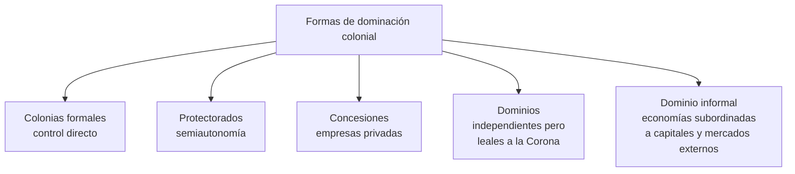
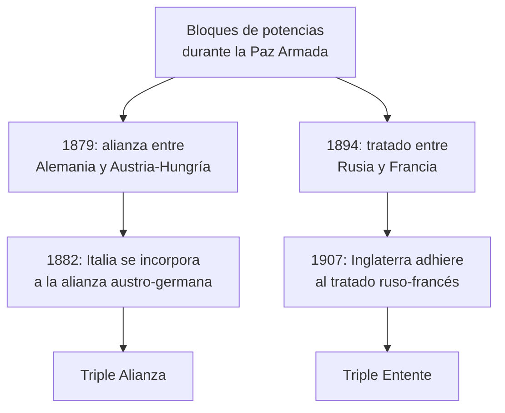

# El reparto del mundo

```{admonition} Bibliografía de referencia
:class: tip
- Hobsbawm, E., *La era del Imperio (1875-1914)*. Barcelona, Labor, 1990.
  Caps. 2 y 4 (bibliografía general de la Clase I; ver también el apunte
  anterior sobre el nuevo ritmo de la economía).
```

## 1. El nuevo imperialismo: de la crisis económica al reparto colonial

Como se desarrolló en el apunte anterior, la caída de la rentabilidad a
partir de 1873 empujó a las potencias industriales a buscar, fuera de sus
fronteras, lo que ya no conseguían garantizar dentro de ellas: mercados
cautivos, materias primas baratas y destinos para el capital acumulado.
Ese impulso económico se combinó con otros dos planos que conviene
distinguir con claridad.

```{admonition} Tres dimensiones del nuevo imperialismo
:class: important
- **Económica**: mercados cautivos, abaratamiento de costos y colocación
  de capitales excedentes (desarrollado en el apunte anterior).
- **Política**: la búsqueda de colonias satisfacía la expansión de los
  Estados y la demanda nacionalista de prestigio internacional y
  militar.
- **Ideológica**: la posesión de colonias se justificó desde una
  perspectiva eurocéntrica que proclamaba la superioridad de la "raza
  blanca" y una supuesta "misión civilizadora".
```

## 2. Las formas de dominación colonial

El "reparto del mundo" no fue uniforme: las potencias europeas
desarrollaron distintos grados y modalidades de control sobre los
territorios conquistados o influenciados, desde la anexión directa hasta
formas de dependencia puramente económica.



Esta última categoría, el **dominio informal**, es clave para entender
casos como el de América Latina —y en particular la Argentina, tratada en
el último apunte de esta unidad—: países formalmente independientes, pero
cuyas economías quedaban subordinadas a los capitales, los mercados y las
decisiones de las grandes potencias, sin necesidad de una ocupación
militar directa.

## 3. El Congreso de Berlín (1884-1885)

El reparto de África fue el episodio más elocuente de esta lógica. En
1884, las potencias europeas se reunieron en Berlín y declararon al
continente africano zona de libre comercio, delimitando una serie de
**esferas de influencia** dentro de las cuales cada país podía apropiarse
legalmente del espacio. La consecuencia inmediata fue un choque creciente
de intereses entre las potencias, que décadas más tarde desembocaría en la
Primera Guerra Mundial.

## 4. La excepción británica

```{note}
Una pregunta clásica de esta unidad es por qué Gran Bretaña fue la única
gran potencia que continuó defendiendo el librecambio en lugar de
sumarse, como el resto, al proteccionismo y a la construcción de un
imperio formal cerrado sobre sí mismo.
```

Cuatro factores explican esta singularidad:

- La ausencia de un campesinado numeroso que reclamara protección
  arancelaria para sus productos.
- La falta de un electorado proteccionista con peso político relevante.
- Su posición como principal exportadora mundial de productos
  industriales y de servicios financieros.
- Su posición, a la vez, como principal importadora mundial de materias
  primas, lo que la beneficiaba directamente del libre comercio.

## 5. Los efectos del reparto: rivalidad, "Belle Époque" y carrera armamentista

El reparto colonial tuvo efectos que excedieron ampliamente lo económico:

- Produjo un fuerte impacto en la concepción teórica y política del
  capitalismo: la economía dejó de pensarse solo en su dimensión mundial
  para adquirir un marcado carácter nacional.
- Generó una intensa **rivalidad económica y política entre las
  naciones**, alimentada además por la creciente ambición alemana de
  proyección mundial (la llamada *Weltpolitik*).
- Coincidió con una etapa de fuerte revitalización y prosperidad
  económica en Europa occidental, conocida como la **Belle Époque**.

## 6. De la rivalidad colonial a los bloques de alianzas

Entre 1871 y 1914, el escenario internacional estuvo dominado por seis
potencias europeas (Gran Bretaña, Francia, Rusia, Austria-Hungría,
Alemania e Italia), a las que se sumaban, ya con peso propio, Estados
Unidos y Japón. El período que va de 1870 a 1914 se conoce como la
**Paz Armada**: una etapa de auge imperialista, gran despliegue industrial
y una creciente carrera armamentista, en la que la tensión entre las
potencias creció al mismo ritmo que se formaban alianzas estratégicas
destinadas, en teoría, a preservar la paz.



```{admonition} Causas de fondo de la tensión previa a 1914
:class: note
- El creciente poderío alemán y su *Weltpolitik*.
- Las tensiones provocadas por el reparto de África.
- Las aspiraciones nacionalistas de diversos pueblos de los Balcanes y de
  Europa Central.
- La desconfianza y el rearme masivo entre los Estados.
```

Este entramado de rivalidades coloniales, alianzas militares y
nacionalismos en tensión es el terreno directo del que surgirá la Primera
Guerra Mundial, ya tratada en la unidad siguiente.

## Glosario para repasar

Nuevo imperialismo
: Expansión colonial de las potencias industriales entre 1875 y 1914,
  motivada por razones económicas, políticas e ideológicas combinadas.

Dominio informal
: Forma de dominación colonial sin ocupación militar directa, en la que
  un país formalmente independiente queda subordinado a los capitales y
  mercados de una potencia extranjera.

Congreso de Berlín
: Reunión de las potencias europeas en 1884-1885 que declaró a África
  zona de libre comercio y delimitó esferas de influencia coloniales.

Belle Époque
: Período de prosperidad y revitalización económica y cultural en Europa
  occidental, aproximadamente entre 1870 y 1914.

Paz Armada
: Período (1870-1914) de paz aparente entre las grandes potencias
  europeas, marcado en realidad por la carrera armamentista y la
  formación de alianzas militares rivales.

Triple Alianza / Triple Entente
: Los dos grandes bloques de alianzas que dividieron a las potencias
  europeas antes de 1914: Alemania, Austria-Hungría e Italia por un lado;
  Francia, Rusia y Gran Bretaña por el otro.
