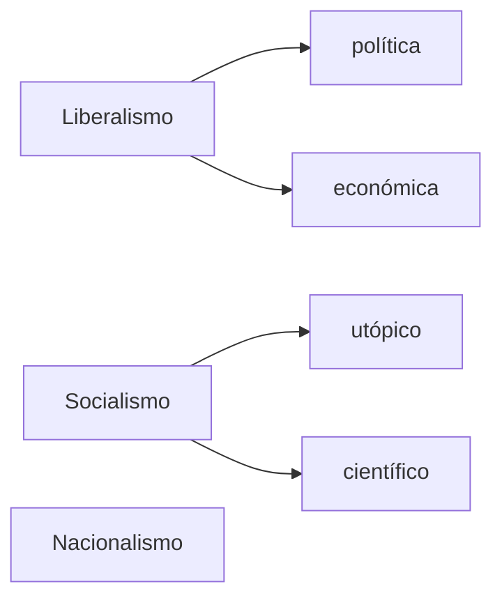
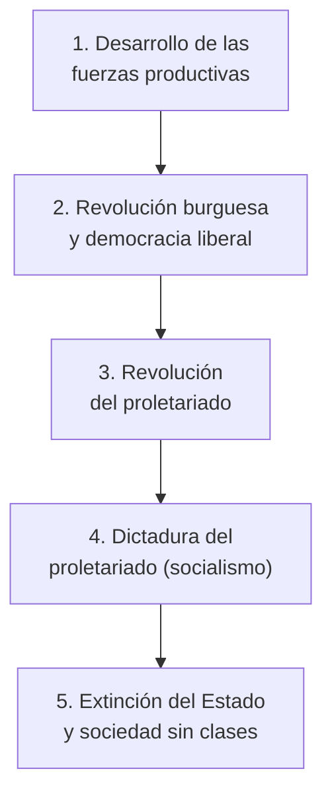

# Las principales corrientes ideológicas: liberalismo, nacionalismo y socialismo

```{admonition} Bibliografía de referencia
:class: tip
- Hobsbawm, E., *La era del Imperio (1875-1914)*. Barcelona, Labor, 1990.
  Cap. 6, "Banderas al viento: las naciones y el nacionalismo".
```

## 1. Dos preguntas para ordenar la unidad

Este apunte cierra el recorrido conceptual de la unidad retomando dos
preguntas que la atraviesan de principio a fin: qué ideas impulsaron las
transformaciones producidas a partir de la segunda mitad del siglo XIX, y
cómo se tradujo ese proceso en América Latina y en la Argentina, tema del
próximo apunte. Las tres grandes corrientes que responden a la primera
pregunta son el **liberalismo**, el **socialismo** y el **nacionalismo**.



## 2. El liberalismo

### 2.1 Genealogía: del contractualismo del siglo XVII al positivismo del XIX

El liberalismo del siglo XIX no nace de la nada: hunde sus raíces en el
**contractualismo** del siglo XVII, la corriente de pensamiento político
que imagina el poder político como resultado de un pacto entre individuos
que abandonan un "estado de naturaleza" presocial.

```{admonition} Los contractualistas
:class: note
- **Thomas Hobbes** (*Leviatán*, 1651): en el estado de naturaleza reina
  la guerra de todos contra todos; el pacto social transfiere el poder a
  un soberano absoluto capaz de garantizar el orden.
- **John Locke** (*Segundo tratado sobre el gobierno civil*, 1690): el
  estado de naturaleza carece de un poder que ejecute la ley común y de
  un tercero imparcial que resuelva los conflictos; de allí la necesidad
  de un gobierno limitado, basado en el consentimiento, que proteja la
  vida, la libertad y la propiedad.
- **Jean-Jacques Rousseau** (Francia): desarrolla su propia versión del
  contrato social centrada en la soberanía popular.
```

Ya en el siglo XIX, esta tradición se combina con nuevas corrientes de
pensamiento científico:

- **Auguste Comte** (*Curso de filosofía positiva*, 1842): sostiene que
  la ciencia y la técnica solucionarán los problemas de la sociedad,
  fundando el **positivismo**.
- **Herbert Spencer** (*La estática social*, 1850): sostiene que las
  sociedades son producto de la selección natural de los individuos,
  trasladando la idea darwiniana de selección al terreno social (el
  llamado *darwinismo social*).

### 2.2 Los principios del liberalismo maduro

```{important}
La razón del individuo, y no la tradición ni la voluntad divina, es el
fundamento del orden social. De ese principio general se derivan sus
traducciones concretas en cada terreno.
```

- **En política**: se traduce en el contractualismo y el
  constitucionalismo —límites al poder del Estado a través del
  parlamento— y en la progresiva conquista del sufragio universal
  (retomada en el apunte anterior).
- **En economía**: se traduce en el librecambio y en la defensa
  irrestricta del derecho de propiedad, con una fuerte creencia en la
  autorregulación del mercado (la "mano invisible") y en el progreso
  indefinido.
- **Como ideología social**: resalta el individualismo, la meritocracia
  y la idea de que todos parten de las mismas oportunidades.

## 3. El socialismo

El socialismo se articula en dos grandes vertientes, una más temprana y
otra que termina por hegemonizar el movimiento obrero hacia fines de
siglo.

### 3.1 El socialismo utópico

Representado por autores como Robert Owen y Charles Fourier, imagina
comunidades alternativas al capitalismo industrial, fundadas en la
cooperación y no en la competencia, pero sin una teoría sistemática de
cómo llegar a ellas ni de las leyes que rigen el desarrollo histórico.

### 3.2 El socialismo científico: Marx y Engels

Karl Marx y Friedrich Engels —autores del *Manifiesto Comunista* de
1848— proponen, en cambio, un análisis que pretende basarse en leyes
históricas tan precisas como las de una ciencia:

```{admonition} Los pilares del marxismo
:class: important
- **Materialismo histórico**: la economía (la "base" o estructura) es el
  fundamento de la historia y de la sociedad. Un cambio en la estructura
  económica provoca cambios en la mentalidad, las ideologías, la
  ciencia, el arte y el derecho (la "superestructura").
- **Lucha de clases**: la historia avanza por el enfrentamiento entre
  quienes poseen los medios de producción (opresores) y quienes solo
  poseen su fuerza de trabajo (oprimidos).
- **Plusvalía**: la ganancia capitalista se origina en el valor que el
  trabajador genera y que no le es retribuido en su salario.
- **El Estado como instrumento de dominación de clase**, a lo largo de
  toda su existencia histórica.
- **La necesidad de una revolución social** que ponga fin a ese orden.
```

Marx describe además el proceso revolucionario como una secuencia de
etapas necesarias:



En esta secuencia, el capitalismo cumple una función "progresista" —crea
tecnología, fábricas y abundancia material— pero también genera a su
propio sepulturero, el proletariado. La democracia liberal burguesa, pese
a ser para Marx una forma de "dictadura de clase", resulta necesaria
porque otorga libertades (reunión, prensa) que los obreros aprovechan
para organizarse. Cuando la propiedad privada ya no puede contener el
desarrollo de las fuerzas productivas, el proletariado organizado toma el
poder político; en la etapa de transición socialista se expropian tierras,
fábricas y bancos, hasta llegar a una sociedad sin clases en la que,
según la fórmula clásica, rige el principio de **"de cada cual según sus
capacidades, a cada cual según sus necesidades"**.

### 3.3 El movimiento obrero organizado: las Internacionales

```{admonition} Las cuatro Internacionales
:class: note
- **1864, Londres**: la Asociación Internacional de Trabajadores (AIT),
  que reúne a distintas corrientes del movimiento obrero europeo (entre
  ellas Bakunin y Marx) para luchar de forma coordinada por encima de
  las fronteras nacionales.
- **1889, París**: la Segunda Internacional, de la que nacen los
  partidos socialdemócratas.
- **1919, Moscú**: la Tercera Internacional, de orientación comunista,
  fundada tras la Revolución Rusa.
- **1940, París**: la Cuarta Internacional, de orientación trotskista.
```

## 4. El nacionalismo

### 4.1 Origen y transformación de la idea de nación

La idea moderna de **"nación"** se introduce con el Romanticismo de
comienzos del siglo XIX —Fichte, en sus *Discursos a la nación alemana*
(1807-1808), es una referencia central— y se consolida hacia fines de
siglo, cuando Ernest Renan se pregunta, en un texto célebre, *¿Qué es una
nación?* (1882).

```{note}
El nacionalismo de fines del siglo XIX ya no es aquel de comienzos de
siglo, ligado a las revoluciones liberales. Se transforma en una
ideología dominante orientada a afianzar la identidad frente a un
"enemigo" externo, y termina convirtiéndose en sinónimo de derecha
política.
```

### 4.2 Rasgos del nuevo nacionalismo

- Definición **étnico-lingüística** de la nación (en lugar de una
  definición cívica más inclusiva), que da impulso a la recuperación o
  invención de idiomas "originales" como forma de unificar a las masas,
  con la escuela como herramienta clave de ese proceso.
- Derecho a la autodeterminación, entendido como sinónimo de
  independencia política.
- Identificación de "nación" con "territorio" y de "nación" con una
  suerte de "religión cívica".
- Contenidos ideológicos recurrentes: antisocialista, antiliberal,
  xenófobo, expansionista y antisemita. Atraviesa a todos los países de
  Europa como una forma de nacionalismo marcadamente racista.
- Fenómeno protagonizado sobre todo por las clases medias, y estrechamente
  ligado a la competencia colonial e imperial tratada en el apunte sobre
  el reparto del mundo.

### 4.3 La contracara internacionalista

Frente al nacionalismo, los socialistas sostenían una posición
**internacionalista**: para ellos, las naciones eran una construcción de
la burguesía, y las verdaderas líneas de conflicto —proletariado contra
burguesía— atravesaban a todos los países por igual, sin importar la
nacionalidad. Esta tensión entre nación y clase obligó a los partidos
socialistas a discutir la "cuestión nacional", sobre todo en los
territorios multinacionales de Europa central y oriental, donde debían
competir con partidos que apelaban directamente a la identidad nacional de
los propios trabajadores.

## Glosario para repasar

Contractualismo
: Corriente de pensamiento político (Hobbes, Locke, Rousseau) que explica
  el origen del poder político como resultado de un pacto entre
  individuos que abandonan el estado de naturaleza.

Positivismo
: Corriente fundada por Auguste Comte que sostiene que la ciencia y la
  técnica pueden resolver los problemas de la sociedad.

Darwinismo social
: Traslado de la idea de selección natural al terreno social, propuesto
  por Herbert Spencer para explicar la desigualdad entre individuos y
  sociedades.

Materialismo histórico
: Teoría marxista según la cual la estructura económica de una sociedad
  determina, en última instancia, su superestructura política, jurídica
  e ideológica.

Plusvalía
: En la teoría marxista, el valor generado por el trabajador que el
  capitalista se apropia sin retribuirlo en el salario, origen de la
  ganancia capitalista.

Internacionalismo
: Posición del movimiento obrero socialista que subordina la identidad
  nacional a la solidaridad de clase entre los trabajadores de todos los
  países.
