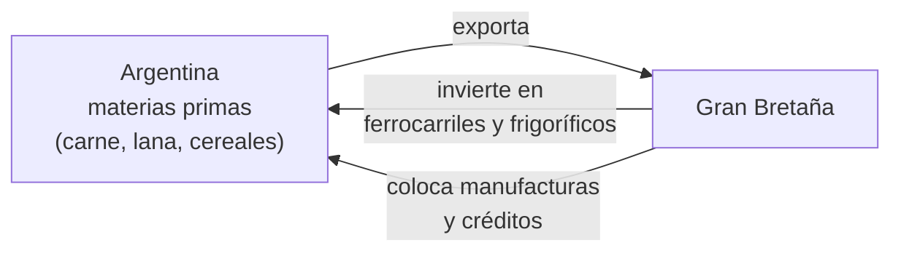

# Panorama de América Latina y la Argentina en el tránsito de un siglo a otro

```{admonition} Bibliografía de referencia
:class: tip
- Romero, L. A., *Breve historia contemporánea de la Argentina*. Buenos
  Aires, Fondo de Cultura Económica. Pp. 15-45.
```

## 1. El panorama regional: repúblicas oligárquicas y agroexportadoras

Hacia el último cuarto del siglo XIX, la mayoría de los países
latinoamericanos —ya estabilizados tras las guerras de independencia y las
luchas civiles de mediados de siglo— se insertaron en la economía mundial
según la misma lógica descripta en el apunte sobre el reparto del mundo:
como proveedores de materias primas y alimentos para las potencias
industriales, bajo regímenes políticos controlados por reducidas élites
terratenientes y comerciales.

```{note}
El propio lema **"Orden y Progreso"**, adoptado por Brasil en su bandera
al proclamarse república en 1889, resume el ideario de la época: el
**positivismo** de Comte y Spencer, tratado en el apunte anterior, no fue
solo una corriente filosófica europea, sino una ideología de Estado
adoptada por buena parte de las élites latinoamericanas para legitimar su
propio poder.
```

Un caso paradigmático es el del **Porfiriato** en México: Porfirio Díaz
gobernó de manera casi ininterrumpida entre 1876 y 1911 apoyado en un
grupo de intelectuales positivistas conocidos como los "científicos", que
promovían la inversión extranjera y la modernización económica al costo
de una fuerte concentración de la tierra y una dura represión política
—contradicciones que, hacia 1910, desembocarían en la Revolución
Mexicana.

En paralelo, Estados Unidos consolidó su influencia regional. La derrota
de España en la Guerra Hispano-Estadounidense de 1898 le permitió
controlar Cuba (formalmente independiente, pero bajo tutela mediante la
Enmienda Platt) y anexar Puerto Rico y Filipinas. En 1903 impulsó la
separación de Panamá de Colombia para asegurarse la construcción del
Canal de Panamá, y en 1904 formuló el **Corolario Roosevelt**, que
reservaba a Washington el derecho de intervenir en cualquier país
latinoamericano en nombre de la estabilidad regional.

## 2. La Argentina en la división internacional del trabajo



Argentina se insertó en este esquema como proveedora de materias primas,
en el marco de una relación de dependencia profunda con Gran Bretaña. Los
capitales británicos financiaron la infraestructura necesaria para
exportar, empezando por el **ferrocarril**, cuyo diseño radial hacía
converger todas las vías hacia el puerto de Buenos Aires. En lo económico,
las élites locales adoptaron el liberalismo británico; en lo político,
combinaron ese liberalismo económico con el conservadurismo y la
represión.

La canasta exportadora fue cambiando con la tecnología disponible:

- A mediados del siglo XIX, Argentina exportaba **tasajo** (carne salada
  de baja calidad, destinada sobre todo a la alimentación de esclavos en
  Brasil y Cuba) y **lana** para la industria textil europea.
- Antes de la refrigeración, el ganado viajaba vivo en pie hacia Europa.
  Con la llegada de los **frigoríficos** británicos (como el Anglo), se
  volvió posible exportar cortes de calidad —carne enfriada o *chilled*—,
  lo que exigió razas de ganado más refinadas, en muchos casos importadas
  directamente desde Gran Bretaña.

## 3. El régimen político conservador (1880-1912)

A partir de 1880 se consolidó en la Argentina un orden político conocido
como el de la **"Generación del 80"**: un régimen oligárquico que
garantizaba su continuidad mediante el fraude electoral sistemático (el
llamado **voto cantado**, público y manipulable) y que convivía, sin
demasiada contradicción, con una intensa modernización económica e
institucional.

```{admonition} Las "leyes laicas" de la década de 1880
:class: note
- **1884, Ley 1420**: establece la educación primaria común, gratuita,
  obligatoria y laica.
- **1884, Ley de Registro Civil**: traslada del ámbito eclesiástico al
  Estado el registro de nacimientos, matrimonios y defunciones.
```

Este mismo Estado en expansión buscó, además, disciplinar y "nacionalizar"
a una sociedad transformada por la inmigración masiva europea, que en
pocas décadas modificó por completo la composición demográfica del país
sin que la enorme masa de inmigrantes accediera, sin embargo, a derechos
políticos plenos.

```{important}
Conviene no confundir dos leyes de esta etapa que suelen aparecer
mezcladas:
- La **Ley de Servicio Militar Obligatorio** (Ley Ricchieri, 1901), que
  funcionó como un instrumento de nacionalización de la población civil,
  muchos de cuyos integrantes eran hijos de inmigrantes.
- La **Ley de Residencia** (Ley 4144, 1902), impulsada por Miguel Cané,
  que otorgaba al Poder Ejecutivo la facultad discrecional de expulsar
  del país, sin juicio previo, a cualquier extranjero considerado una
  amenaza al orden público. Se utilizó sistemáticamente para deportar
  dirigentes sindicales y activistas nacidos en el exterior, en una
  Argentina poblada mayoritariamente por inmigrantes sin derechos
  políticos.
```

La conflictividad social de estos años tuvo un punto culminante en la
**Semana Roja** de mayo de 1909: la represión policial —bajo las órdenes
del jefe de policía Ramón Falcón— de una manifestación obrera por el 1° de
mayo dejó varios muertos y provocó una huelga general de casi diez días,
organizada por la Federación Obrera Regional Argentina (FORA). Como parte
de la misma escalada represiva, en 1910, tras un atentado durante los
festejos del Centenario, se sancionó la **Ley de Defensa Social**, que
restringió aún más la actividad de las organizaciones obreras y
anarquistas.

```{note}
Este ciclo de conservadurismo político y represión social encontraría su
propio límite dos años más tarde: en 1912 se sancionó la **Ley Sáenz
Peña**, que estableció el sufragio secreto y obligatorio y abrió el camino
a los gobiernos radicales, ya en el terreno de la unidad siguiente.
```

## 4. Expansión territorial: la Triple Alianza y la Conquista del Desierto

Dos episodios de expansión y consolidación territorial completan el
panorama de estas décadas.

La **Guerra de la Triple Alianza** (1865-1870) enfrentó a Paraguay contra
la alianza de Argentina, Brasil y Uruguay. Paraguay se había desarrollado
hasta entonces como una nación relativamente autónoma, con metalurgia
propia, astilleros y uno de los mejores ejércitos de la región, un modelo
de desarrollo que quedaba al margen de la órbita comercial británica.
Argentina y Brasil, en cambio, consolidaban una alianza económica con Gran
Bretaña basada en el libre comercio. El detonante inmediato fue una crisis
política en Uruguay, pero el trasfondo regional enfrentaba dos modelos de
inserción económica claramente distintos.

La **Conquista del Desierto** (1878-1885, con antecedentes desde 1875)
consistió en una serie de campañas militares —asociadas sobre todo al
general Julio A. Roca— que incorporaron la Pampa húmeda, el sur de Buenos
Aires, Río Negro y Neuquén al control efectivo del Estado nacional. El
reparto de las tierras conquistadas benefició de manera desigual a un
número reducido de familias de la élite terrateniente, mientras que las
comunidades indígenas derrotadas sufrieron el desmembramiento de su
estructura social. El objetivo económico de fondo era expandir la
frontera productiva para dedicar la región pampeana a la ganadería de
exportación de alta calidad.

## Glosario para repasar

Generación del 80
: Élite política y social que dominó la Argentina entre 1880 y 1916 bajo
  un régimen oligárquico sostenido por el fraude electoral.

Voto cantado
: Práctica electoral fraudulenta habitual del régimen conservador, en la
  que el voto se emitía de forma pública y podía ser controlado o
  comprado.

Ley de Residencia
: Ley 4144 (1902) que facultó al Poder Ejecutivo a expulsar del país, sin
  juicio previo, a extranjeros considerados una amenaza al orden público;
  se usó contra dirigentes sindicales inmigrantes.

Semana Roja
: Huelga general de mayo de 1909 desatada por la represión policial de
  una manifestación obrera del 1° de mayo en Buenos Aires.

Conquista del Desierto
: Campañas militares (1878-1885) que incorporaron al Estado argentino
  vastos territorios de la Patagonia norte y la región pampeana, a costa
  de las comunidades indígenas que los habitaban.

Ley Sáenz Peña
: Ley electoral de 1912 que estableció el sufragio secreto y obligatorio,
  poniendo fin al período de fraude sistemático del régimen conservador.
