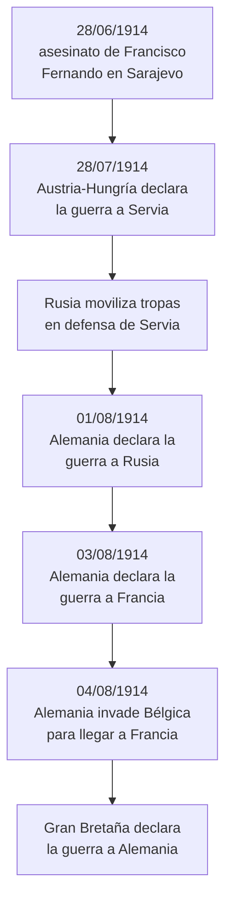

# Las guerras mundiales: rasgos y novedades

```{admonition} Bibliografía de referencia
:class: tip
- Hobsbawm, E., *Historia del siglo XX*. Barcelona, Crítica, 1995. "Vista panorámica del siglo XX".
- Hobsbawm, E., *Historia del siglo XX*. Barcelona, Crítica, 1995. Cap. 1.
```

## 1. El "siglo XX corto" como marco de análisis

Hobsbawm propone leer el siglo XX no en términos estrictamente cronológicos (1900-2000), sino como una unidad histórica que se abre en 1914 —con el estallido de la Primera Guerra Mundial— y se cierra en 1991 —con la disolución de la URSS—. A este arco lo llama el **"siglo XX corto"**, y lo organiza en tres grandes tramos:

- **La era de la catástrofe** (1914-1945): las dos guerras mundiales, la crisis de 1929 y el ascenso de los fascismos.
- **La edad de oro** (1945-1973): expansión económica sostenida, Estado de bienestar, guerra fría "administrada" entre bloques.
- **El derrumbe** (1973-1991): agotamiento del modelo de posguerra y disolución del bloque soviético.

```{important}
En esta periodización, las guerras mundiales no son un episodio más: son el hecho fundacional que quiebra el orden del "largo siglo XIX" (1789-1914) —liberal, eurocéntrico, confiado en el progreso— e inaugura una época marcada por la violencia de masas y la inestabilidad.
```

## 2. El estallido de la Primera Guerra Mundial

El entramado de rivalidades coloniales, alianzas rígidas y nacionalismos exacerbados que se describió en el apunte sobre el reparto del mundo (unidad 1) —Paz Armada, Triple Alianza, Triple Entente— explica por qué, en 1914, un incidente local pudo escalar en cuestión de semanas a una guerra continental: bastó una chispa para que el sistema de alianzas disparara una reacción en cadena.

### 2.1 El magnicidio de Sarajevo (28 de junio de 1914)

En el Imperio austrohúngaro, la muerte del heredero directo del emperador Francisco José, su hijo Rodolfo (1889), y la posterior renuncia y muerte de su hermano Carlos Luis dejaron la línea sucesoria en manos del sobrino del emperador, el archiduque Francisco Fernando. En junio de 1914, Francisco Fernando visitó Sarajevo, capital de Bosnia-Herzegovina, provincia anexada por Austria-Hungría en 1908 en medio del rechazo del nacionalismo serbio, que aspiraba a integrarla a una Gran Serbia.

Durante la visita, un grupo de jóvenes nacionalistas bosnios vinculados a la organización serbia *Mano Negra* intentó asesinarlo en dos oportunidades el mismo día: primero, una bomba arrojada contra su automóvil falló y terminó hiriendo a la comitiva que lo seguía; horas más tarde, un error del chofer hizo que el vehículo se detuviera frente a uno de los conspiradores, Gavrilo Princip, quien disparó y mató al archiduque y a su esposa, Sofía. El Imperio austrohúngaro responsabilizó directamente al Estado serbio por el atentado.

### 2.2 La crisis de julio y la reacción en cadena de las alianzas

Respaldada por el "cheque en blanco" alemán —la garantía de apoyo incondicional de Alemania—, Austria-Hungría le entregó a Serbia, el 23 de julio de 1914, un ultimátum con condiciones deliberadamente inadmisibles. Serbia aceptó casi todos los puntos, pero rechazó que funcionarios austríacos participaran directamente de la investigación en su propio territorio. Austria-Hungría declaró la guerra el 28 de julio de 1914, y a partir de ahí el sistema de alianzas actuó como una máquina automática:



Nadie imaginó, en agosto de 1914, que el conflicto se prolongaría cuatro años y dejaría cerca de quince millones de muertos. La lógica del capitalismo industrial y del nacionalismo de masas —que hasta entonces había servido para enfrentar a las clases populares entre sí, culpando al "extranjero" antes que al propio orden social— encontró en la guerra su expresión más extrema.

## 3. El desarrollo del conflicto (1914-1918)

### 3.1 El fracaso del Plan Schlieffen

El Estado Mayor alemán, bajo los lineamientos trazados años antes por el general Alfred von Schlieffen, había diseñado un plan para evitar la pesadilla de una guerra en dos frentes: derrotar primero a Francia en pocas semanas, atacando a través de Bélgica para rodear sus defensas, y recién después volcar las tropas hacia el este, antes de que la lenta maquinaria de movilización rusa estuviera lista.

El plan fracasó. Rusia movilizó más rápido de lo previsto y obligó a Alemania a desviar tropas al frente oriental; en el oeste, franceses y británicos frenaron el avance alemán en la primera batalla del Marne (septiembre de 1914), a las puertas de París. Ambos bandos intentaron entonces flanquearse mutuamente hacia el norte en la llamada "carrera hacia el mar", hasta toparse con el canal de la Mancha: quedó así fijado un frente continuo, desde Suiza hasta el mar del Norte, que ya no se movería de manera sustancial durante casi cuatro años.

```{note}
En el frente balcánico, la ofensiva austrohúngara contra Servia no logró el éxito rápido que se esperaba: fue rechazada en 1914 con fuertes pérdidas, y Servia solo sería ocupada a fines de 1915, con el apoyo de tropas alemanas y búlgaras.
```

### 3.2 La guerra de trincheras y la ampliación de los frentes

Entre 1914 y 1917, el frente occidental se convirtió en una guerra estática: millones de soldados atrincherados se enfrentaron en ofensivas de altísimo costo humano y avances territoriales mínimos, en batallas como Verdún o el Somme (ambas en 1916).

El conflicto, además, no dejó de sumar frentes y países:

- **Italia**, formalmente aliada de Alemania y Austria-Hungría en la Triple Alianza, se declaró neutral en 1914 alegando que el pacto era defensivo y que Austria había atacado primero. En 1915 firmó en secreto el Tratado de Londres y se sumó a la Entente a cambio de promesas territoriales, abriendo el frente alpino contra Austria-Hungría.
- El **Imperio otomano** se sumó a las Potencias Centrales a fines de 1914, abriendo frentes en el Cáucaso y Medio Oriente.
- **Japón**, aliado de Gran Bretaña desde 1902, le declaró la guerra a Alemania en 1914 y ocupó sus posesiones en el Pacífico y en China.
- **Bulgaria** se sumó a las Potencias Centrales en 1915; **Rumania** y **Grecia**, a la Entente, en 1916 y 1917 respectivamente.
- Finalmente, **Estados Unidos** entró en 1917 (ver más abajo).

A los frentes terrestres —occidental, oriental, balcánico y, desde 1915, alpino— se sumaron el frente naval y, por primera vez en la historia, el frente aéreo: aparecieron los primeros aviones de combate, todavía de madera y tela, usados al principio para reconocimiento y luego para el combate aéreo directo. En el mar, los submarinos alemanes (U-Boote), perfeccionados durante la guerra, disputaron el control de las rutas marítimas a la flota de superficie británica, que mantuvo un bloqueo naval sobre las Potencias Centrales. El único gran choque de flotas de toda la guerra, la batalla de Jutlandia (1916), resultó indecisa, pero mantuvo a Gran Bretaña con el dominio efectivo de los mares.

### 3.3 La industrialización de la muerte: nuevas armas

La guerra de trincheras hizo de la ametralladora el arma decisiva del frente occidental: cualquier avance frontal se convertía en una masacre, lo que explica en buena medida el estancamiento del frente durante años. A eso se sumaron otras novedades bélicas:

- Los **gases venenosos**, usados por primera vez por Alemania (gas cloro) en la segunda batalla de Ypres, en 1915, y luego adoptados por todos los bandos; desde 1917 se sumó el gas mostaza, más letal y persistente.
- El **tanque de guerra**, desarrollo británico empleado por primera vez en la batalla del Somme, en 1916, como intento de romper el estancamiento de las trincheras.
- La **artillería pesada**, que multiplicó la capacidad destructiva de los bombardeos previos a cada ofensiva.

Todo esto consolidó la idea de una **guerra masiva e industrial**, en la que la capacidad productiva de cada país pesaba tanto como la estrategia militar.

### 3.4 La entrada de Estados Unidos y el desenlace (1917-1918)

En 1917, Estados Unidos entró en la guerra del lado de la Entente, de la mano del presidente Woodrow Wilson, que había hecho campaña de reelección en 1916 prometiendo mantener la neutralidad. El giro se explica por la guerra submarina alemana sin restricciones —que ya había hundido el transatlántico *Lusitania* en 1915— y por el telegrama Zimmermann, en el que Alemania proponía una alianza a México contra Estados Unidos.

Mientras tanto, en el este, la Revolución Rusa de 1917 sacó a Rusia de la guerra: el nuevo gobierno bolchevique firmó el Tratado de Brest-Litovsk en marzo de 1918. Alemania, liberada del frente oriental, lanzó en la primavera de 1918 una última gran ofensiva en el oeste que logró avances iniciales pero se agotó por falta de recursos —en particular de acero y otras materias primas, escasas pese a la mejor preparación militar alemana—. Desde mediados de 1918, ya con tropas estadounidenses frescas reforzando a la Entente, Alemania retrocedió de manera sostenida.

```{admonition} La leyenda de la puñalada por la espalda
:class: warning
En septiembre de 1918, ante la evidencia de la derrota, el Alto Mando alemán (Hindenburg y Ludendorff) le pidió al káiser Guillermo II que buscara un armisticio, pero atribuyó el desenlace no al fracaso militar propio sino a una supuesta traición interna de los socialistas alemanes. Este relato —la *Dolchstoßlegende*, o "leyenda de la puñalada por la espalda"— sería explotado políticamente por el nazismo pocos años después.
```

A comienzos de noviembre de 1918 estalló un motín naval en Kiel que se extendió como una ola revolucionaria por toda Alemania; el 9 de noviembre el káiser abdicó y se proclamó la república. El armisticio se firmó y entró en vigencia a las 11 de la mañana del 11 de noviembre de 1918 —la hora undécima del día undécimo del mes undécimo—, poniendo fin a cuatro años de guerra.

## 4. El Tratado de Versalles (1919)

En 1919 las potencias vencedoras se reunieron en París para negociar la paz, sin participación alemana en las tratativas: por eso, en Alemania se lo conoció como un *Diktat*, una paz impuesta. El tratado con Alemania se firmó en Versalles; con los otros derrotados —Austria, Hungría, Bulgaria y el Imperio otomano— se firmaron tratados separados.

```{admonition} Principales cláusulas del Tratado de Versalles
:class: important
- Alemania pierde todas sus colonias, repartidas como mandatos de la Sociedad de Naciones entre las potencias vencedoras.
- Alsacia y Lorena vuelven a manos francesas.
- Se crea el "corredor polaco" y la ciudad libre de Dánzig, que separan a Prusia Oriental del resto de Alemania para darle salida al mar a la nueva Polonia.
- Alemania cede territorios a la recién creada Checoslovaquia.
- Renania queda desmilitarizada: prohibición de mantener tropas o fortificaciones en la frontera con Francia.
- La flota de guerra alemana debe entregarse a Gran Bretaña; internada en Scapa Flow, es autohundida en junio de 1919 por sus propios oficiales para evitar la entrega, y varios marineros alemanes mueren a manos de guardias británicos en la confusión posterior.
- El ejército queda limitado a cien mil soldados, sin servicio militar obligatorio.
- Se prohíbe a Alemania tener tanques, aviación militar y submarinos; su flota de guerra queda limitada en tamaño y cantidad de buques.
- La "cláusula de culpabilidad de guerra" (art. 231) declara a Alemania única responsable del conflicto, fundamento de una indemnización multimillonaria, en la práctica impagable.
```

Versalles impuso condiciones humillantes sobre una Alemania que, además, nunca había sido invadida ni ocupada: su ejército seguía en territorio extranjero al momento del armisticio. Esa combinación —derrota sin invasión, "puñalada por la espalda" y un tratado vivido como un despojo injusto— alimentó un resentimiento nacionalista que el nazismo explotaría políticamente años más tarde, como se retoma en el apunte sobre los fascismos, la Segunda Guerra y el Holocausto.

## 5. Rasgos generales de las guerras mundiales

A partir de esta primera contienda, y con mayor intensidad todavía en la Segunda Guerra Mundial, pueden identificarse una serie de rasgos comunes a ambos conflictos:

### 5.1 Guerra total

Ambas contiendas dejan de ser enfrentamientos limitados entre ejércitos profesionales y pasan a involucrar a la totalidad de la sociedad: la economía, la industria, la mano de obra civil (incluidas las mujeres, que se incorporan masivamente a la producción) y la propaganda quedan puestas al servicio del esfuerzo bélico. El Estado interviene la economía, planifica la producción y raciona el consumo.

### 5.2 Escala y alcance mundial

Son guerras genuinamente **mundiales**: no solo por involucrar a las grandes potencias europeas, sino por movilizar recursos humanos y materiales de los imperios coloniales (tropas africanas, asiáticas, de Oceanía) y por extender los frentes de combate a varios continentes y océanos.

### 5.3 Industrialización de la destrucción

La aplicación de la tecnología industrial a la guerra multiplica su capacidad destructiva: ametralladoras, artillería pesada, gases tóxicos, tanques, aviación y, en la Segunda Guerra, misiles y la bomba atómica. La guerra se vuelve una cuestión de capacidad productiva tanto como de estrategia militar.

### 5.4 Disolución de la frontera entre combatientes y civiles

A diferencia de los conflictos del siglo XIX, la población civil se convierte en objetivo militar legítimo: bombardeos sobre ciudades, bloqueos económicos que buscan el hambre del enemigo, deportaciones y, en su forma más extrema, el genocidio planificado durante la Segunda Guerra Mundial.

### 5.5 Dimensión ideológica

Especialmente en la Segunda Guerra Mundial, el conflicto adquiere un carácter marcadamente ideológico: no se trata solo de una disputa entre Estados por territorio o hegemonía, sino de un enfrentamiento entre proyectos de sociedad antagónicos (democracias liberales, fascismos, comunismo soviético).

## 6. Principales novedades respecto a los conflictos previos

```{admonition} Síntesis comparativa
:class: note
- **Duración y desgaste**: guerras largas de posiciones (sobre todo la Primera Guerra) frente a la guerra de movimientos del siglo XIX.
- **Magnitud de las bajas**: cifras de muertos y heridos sin precedentes, tanto militares como civiles.
- **Movilización económica total**: la industria y la agricultura se subordinan a la producción bélica.
- **Rol de la propaganda y los medios de comunicación de masas** en el sostenimiento del esfuerzo de guerra.
- **Aparición de armas de destrucción masiva**: gases (1914-1918) y arma nuclear (1945).
```

## 7. Consecuencias de conjunto

- Redibujo del mapa político europeo y mundial (caída de los imperios centrales y otomano tras 1918; nuevo orden bipolar tras 1945).
- Aceleración de procesos revolucionarios (Revolución rusa de 1917) y de las tensiones sociales que favorecen el ascenso de los fascismos en el período de entreguerras.
- Impulso a los procesos de descolonización, en particular después de 1945.
- Consolidación de la idea de que el siglo XX es, en palabras de Hobsbawm, "el siglo más sanguinario del que se tiene noticia".

## Glosario para repasar

Guerra total
: Conflicto que moviliza la totalidad de los recursos humanos, económicos e industriales de un Estado, y que borra la distinción entre frente y retaguardia.

Siglo XX corto
: Periodización de Hobsbawm que va de 1914 a 1991, tomando como hitos la Primera Guerra Mundial y la disolución de la URSS.

Era de la catástrofe
: Primer tramo del siglo XX corto (1914-1945), signado por las dos guerras mundiales, la crisis de 1929 y el auge de los fascismos.

Crisis de julio
: Sucesión de ultimátums, movilizaciones y declaraciones de guerra desencadenada por el asesinato de Sarajevo, que entre el 28 de junio y el 4 de agosto de 1914 activó en cadena el sistema de alianzas y convirtió un conflicto local en una guerra continental.

Plan Schlieffen
: Plan militar alemán que buscaba evitar una guerra en dos frentes derrotando primero a Francia por Bélgica, en pocas semanas, antes de que Rusia completara su movilización. Su fracaso en 1914 convirtió la guerra relámpago prevista en una guerra de desgaste prolongada.

Guerra de trincheras
: Modalidad de combate estático característica del frente occidental entre 1914 y 1917, en la que ambos bandos, atrincherados a lo largo de cientos de kilómetros, se enfrentaban en ofensivas de altísimo costo humano y escaso avance territorial.

Dolchstoßlegende (leyenda de la puñalada por la espalda)
: Mito difundido por los militares y sectores nacionalistas alemanes tras 1918, según el cual la derrota no se debió al fracaso militar sino a una traición interna de civiles y socialistas. Fue explotado políticamente por el nazismo en la década siguiente.

Tratado de Versalles
: Tratado de paz firmado en 1919 entre los Aliados y Alemania, que impuso pérdidas territoriales y coloniales, desarme, ocupación y reparaciones económicas, y estableció la cláusula de culpabilidad exclusiva de Alemania en el origen de la guerra.
