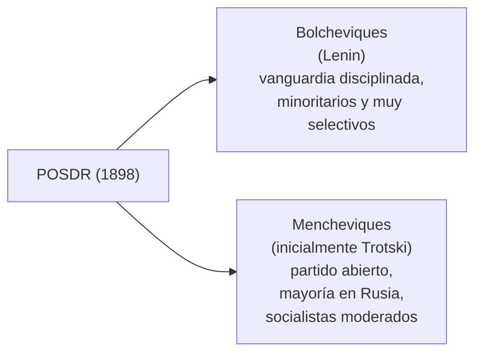

# La Revolución Rusa y los avatares de la URSS hasta 1945

```{admonition} Bibliografía de referencia
:class: tip
- Hobsbawm, E., *Historia del siglo XX*. Barcelona, Crítica, 1995. Cap. II,
  "La revolución mundial".
- Villani, P., *La edad contemporánea, 1914-1945*. Barcelona, Ariel, 1997.
  Pp. 36-45 y 135-146.
```

```{important}
Hobsbawm compara la Revolución de Octubre de 1917 con la Revolución
Francesa de 1789, y sostiene que sus efectos fueron incluso más profundos
y duraderos: en pocas décadas, una tercera parte de la humanidad llegó a
vivir bajo regímenes derivados del modelo bolchevique. Por eso la llama,
directamente, **"la revolución mundial"**.
```

## 1. Rusia hacia 1900: un imperio en crisis

El Imperio ruso era, hacia 1900, el país más extenso del mundo, pero
arrastraba un sistema de gobierno autocrático y anacrónico. Al mando
estaba el zar **Nicolás II**, de la dinastía Románov. Aunque en 1861 se
había abolido la servidumbre, el 90% de una población de unos 135 millones
de habitantes seguía viviendo en la pobreza extrema, mayoritariamente
campesina y analfabeta, sometida al control de la **"Mir"** (la asamblea
comunal que distribuía tierras y trabajo).

Ese campesinado empobrecido alimentó la migración hacia las ciudades que
comenzaban a industrializarse, como San Petersburgo y Moscú, donde se
formó una nueva clase obrera de jornadas larguísimas y salarios miserables:
el caldo de cultivo ideal para las ideas revolucionarias. Para contener la
oposición, el zarismo dependía de la **Ojrana**, su policía secreta.

## 2. Los orígenes del movimiento revolucionario

En 1898 se fundó el **Partido Socialdemócrata de los Trabajadores de
Rusia** (POSDR), impulsado por Plejánov. En 1902, Lenin publicó *¿Qué
hacer?*, un texto decisivo que sostenía que la revolución no ocurriría de
forma espontánea, sino que requería una **vanguardia profesional y
disciplinada** capaz de dirigir el proceso, organizada en torno a un
periódico de propaganda nacional: *Iskra* ("La Chispa").

Esta visión provocó, en el congreso partidario de 1903, una fractura
irreconciliable:



Los **mencheviques** defendían un partido abierto a cualquier trabajador y
creían que la revolución solo llegaría cuando toda la población alcanzara
una conciencia de clase plena. Los **bolcheviques** de Lenin sostenían que
no era necesario esperar esa conciencia generalizada: bastaba con que una
élite disciplinada dirigiera el proceso en nombre de las masas.

## 3. La Revolución de 1905: un ensayo general

La derrota humillante de Rusia en la guerra ruso-japonesa (1904-1905) y la
agudización de la crisis económica y social desataron la primera gran
crisis del régimen. El **"Domingo Sangriento"** (22 de enero de 1905) fue
el punto de quiebre: una marcha pacífica de obreros hacia el Palacio de
Invierno, liderada por el pope Gapón, que reclamaba mejoras sociales y una
monarquía constitucional con sufragio universal, fue reprimida a tiros por
las tropas del zar.

```{note}
La represión del Domingo Sangriento destruyó definitivamente el vínculo
afectivo entre el pueblo y el zar. Como consecuencia directa surgieron los
**soviets** —consejos de obreros y soldados— y el zar debió prometer la
creación de una Duma (parlamento), a la que luego vació de poder real
apenas la situación se estabilizó.
```

## 4. La Primera Guerra Mundial acelera el colapso

Pese al desastre reciente contra Japón, Rusia entró en la Primera Guerra
Mundial en 1914 con una infraestructura industrial y logística deficiente.
Las derrotas militares, sumadas al desabastecimiento de las ciudades,
reactivaron con más fuerza que nunca el poder de los soviets y dejaron al
zarismo al borde del colapso final.

## 5. La Revolución de Febrero de 1917

En febrero de 1917 (calendario juliano), el desabastecimiento se volvió
insoportable, estallaron huelgas masivas de metalúrgicos y manifestaciones
obreras que confluyeron con la marcha del Día Internacional de la Mujer.
A diferencia de 1905, el ejército —muchos de origen campesino y obrero—
se negó a reprimir y se sumó a la protesta. El zar disolvió la Duma, mientras
los soviets exigían un gobierno provisional integrado por liberales y
socialistas. Sin apoyo militar, **Nicolás II abdicó** el 2 de marzo en
favor de su hermano Miguel, quien rechazó el trono: así terminaron 300
años de dinastía Románov.

## 6. El doble poder y las Tesis de Abril

Se instauró un **Gobierno Provisional**, primero bajo el príncipe Lvov,
que convivía en un incómodo **"doble poder"** con el Soviet de Petrogrado.

```{admonition} Reformas del gobierno provisional
:class: note
- Amnistía a presos políticos.
- Libertad de expresión.
- Reconocimiento del derecho a la huelga.
- Abolición de privilegios estamentales.
- Convocatoria a una Asamblea Constituyente.
- Continuación de Rusia en la guerra (su decisión más costosa).
```

Alemania, buscando sacar a Rusia de la guerra, facilitó el regreso de
Lenin desde su exilio en Suiza en un tren blindado. A su llegada, Lenin
expuso las **Tesis de Abril**, resumidas en la consigna **"Paz, Pan y
Tierra"** y en el lema **"todo el poder a los soviets"**:

```{important}
Conquista del poder a corto plazo; oposición a la Primera Guerra Mundial;
confiscación de las grandes propiedades; nacionalización de la tierra;
instauración inmediata del socialismo; control obrero de la producción; y
el partido bolchevique como motor y guía de la clase obrera.
```

Ante el fracaso de una nueva ofensiva militar rusa y el creciente
descontento popular, Lvov fue reemplazado por el socialista moderado
**Aleksandr Kérenski**, que tampoco logró sostener el esfuerzo de guerra
ni contener la desintegración del ejército.

## 7. La Revolución de Octubre

Con mayoría bolchevique en el Soviet de Petrogrado y bajo la organización
de la **Guardia Roja**, los bolcheviques asaltaron el Palacio de Invierno
en octubre de 1917, mientras los mencheviques abandonaban el gobierno
provisional. Lenin firmó de inmediato dos decretos clave: el **decreto de
la paz** (fin de la participación rusa en la guerra) y el **decreto de la
tierra**, que convalidaba la toma de tierras ya realizada por los
campesinos y soldados.

## 8. La construcción del nuevo Estado soviético

El nuevo gobierno, con **Lenin como jefe de Estado hasta su muerte en
1924**, descartó la colaboración con otros partidos y formó el primer
Estado comunista del mundo. Suprimió los periódicos de la oposición,
nacionalizó las industrias y desarrolló una intensa represión contra sus
adversarios a través de una policía secreta, la **Checa**.

Para consolidar el poder interno era urgente salir de la guerra: en marzo
de 1918 se firmó el **Tratado de Brest-Litovsk**, extremadamente duro para
Rusia, que perdió Finlandia, Polonia, los países bálticos, Ucrania y
Bielorrusia, formando un "cordón sanitario" de estados bajo influencia
alemana.

## 9. La guerra civil (1918-1921)

Rusia se sumergió entonces en una sangrienta guerra civil que enfrentó a
múltiples bandos: el **Ejército Rojo** (organizado con disciplina férrea
por Trotski) contra el **Ejército Blanco** (antiguos oficiales zaristas),
con la aparición adicional de un Ejército Negro anarquista y Ejércitos
Verdes campesinos que combatían tanto a rojos como a blancos. Potencias de
la Entente y Japón intervinieron apoyando a los blancos para frenar el
avance del comunismo.

Durante este período se impuso el **"Comunismo de Guerra"**: racionamiento,
trueque y confiscación forzosa de alimentos, que generó un fuerte colapso
económico y revueltas campesinas.

## 10. De la NEP a la fundación de la URSS

Frente a ese colapso, Lenin dio un giro en 1921 con la **Nueva Política
Económica (NEP)**, que permitió un retorno parcial al mercado y al uso del
dinero. Surgieron entonces los **"kulaks"**, campesinos que prosperaron
con las mejores tierras. En 1922, ya más estabilizada la situación, se
fundó formalmente la **Unión de Repúblicas Socialistas Soviéticas (URSS)**.

## 11. De Lenin a Stalin

La muerte de Lenin en 1924 desató una feroz lucha por el poder entre
**Trotski**, que defendía la "revolución permanente" (exportar la
revolución al resto del mundo), y **Stalin**, que apostaba por el
**"socialismo en un solo país"**. Stalin se impuso y, hacia 1927, ya
controlaba el aparato del Estado.

## 12. Los planes quinquenales y la colectivización forzosa

Con la NEP abolida, Stalin lanzó una industrialización acelerada mediante
una sucesión de **planes quinquenales**:

```{admonition} Los planes quinquenales de Stalin
:class: important
- **Primer plan (1928-1932)**: aumentar la importancia de la industria
  pesada para lograr una autonomía industrial frente al extranjero;
  método, la colectivización forzosa de la tierra, con un altísimo costo
  social.
- **Segundo plan (1933-1938)**: desarrollo y mejora de la industria
  pesada y de la vida de la población; la producción de carbón y acero se
  triplicó, aunque a costa del consumo y de los bienes de uso.
- **Tercer plan (1939-1941)**: buscaba desarrollar la industria a costa
  del consumo para convertir a la URSS en una potencia militar, pero fue
  interrumpido por la invasión nazi de 1941.
```

Este proceso eliminó a los kulaks como clase social y convirtió toda la
propiedad agraria en granjas estatales o colectivas, al tiempo que se
expandía el sistema de **Gulags**, campos de trabajo forzado para
disidentes y "enemigos del pueblo".

## 13. El terror estalinista

El control de Stalin se radicalizó a partir de 1936 con la **Gran Purga**,
un período de terror en el que fueron ejecutados casi todos los antiguos
colaboradores de Lenin y figuras históricas de la revolución. Trotski, tras
ser expulsado de la URSS, terminó exiliado y fue asesinado en México en
1940 por orden de Stalin.

## 14. La URSS en la Segunda Guerra Mundial

En 1939, la URSS firmó un pacto de no agresión con la Alemania nazi (el
Pacto Ribbentrop-Mólotov) que incluía el reparto de Polonia. La invasión
alemana de junio de 1941 (Operación Barbarroja) rompió ese pacto y
arrastró a la Unión Soviética a la guerra contra el Eje, en el frente que
resultaría más sangriento y decisivo del conflicto —tratado con más
detalle en el apunte sobre los fascismos, la Segunda Guerra y el
Holocausto.

## Glosario para repasar

Bolcheviques / mencheviques
: Las dos facciones en que se dividió el POSDR en 1903: los primeros,
  partidarios de una vanguardia disciplinada liderada por Lenin; los
  segundos, de un partido abierto y una estrategia más gradualista.

Domingo Sangriento
: Represión zarista de una marcha obrera pacífica en enero de 1905, que
  quebró el vínculo entre el pueblo y la monarquía.

Tesis de Abril
: Programa expuesto por Lenin en 1917 que proponía la conquista inmediata
  del poder bajo la consigna "todo el poder a los soviets".

Comunismo de Guerra
: Política económica de requisición forzosa y racionamiento aplicada
  durante la guerra civil rusa (1918-1921).

NEP (Nueva Política Económica)
: Retorno parcial al mercado impulsado por Lenin en 1921 tras el colapso
  económico del Comunismo de Guerra.

Gran Purga
: Campaña de represión política de 1936-1938 mediante la cual Stalin
  eliminó a buena parte de la vieja guardia bolchevique.
