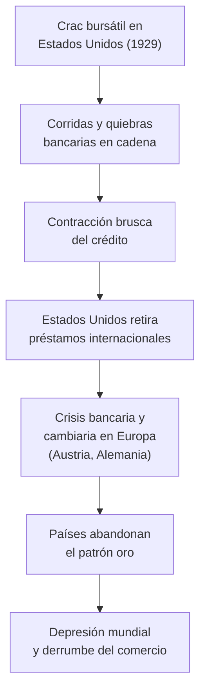

# La crisis económica del 29 y sus consecuencias

```{admonition} Bibliografía de referencia
:class: tip
- Kindleberger, Ch., *La crisis económica 1929-1939*. Barcelona, Crítica,
  1985. Cap. 14.
```

## 1. El final de los "felices años veinte"

Tras la Primera Guerra Mundial, Estados Unidos vivió una década de fuerte
expansión económica sostenida en la producción en masa de tipo fordista
—desarrollada en el apunte sobre el nuevo ritmo de la economía— y en un
consumo creciente financiado con crédito fácil. Buena parte de ese
crédito, sin embargo, no se dirigía a la producción sino a la
**especulación bursátil**: comprar acciones "a margen" (con dinero
prestado) se había vuelto una práctica masiva, mientras que el agro
estadounidense y mundial arrastraba ya, desde mediados de la década, una
crisis de sobreproducción y precios en caída.

## 2. El crac de Wall Street (octubre de 1929)

La burbuja especulativa estalló entre el **"jueves negro"** (24 de
octubre) y el **"martes negro"** (29 de octubre) de 1929: una ola de
ventas masivas de acciones hundió la bolsa de Nueva York. Quienes habían
comprado a crédito quedaron arruinados, y los bancos que habían financiado
esa especulación comenzaron a sufrir corridas y quiebras en cadena.

```{note}
El crac bursátil fue el detonante visible, pero no explica por sí solo por
qué una crisis financiera estadounidense se transformó en una **depresión
económica mundial** de una profundidad sin precedentes. Esa es,
precisamente, la pregunta central que aborda Kindleberger.
```

## 3. La tesis de Kindleberger: la ausencia de un estabilizador internacional

Charles Kindleberger sostiene que la Gran Depresión se volvió mundial y
tan prolongada porque el sistema económico internacional se quedó sin un
**país capaz de estabilizarlo**. Antes de 1914, Gran Bretaña había
cumplido ese rol: actuaba como prestamista de última instancia, mantenía
abierto su mercado a las importaciones incluso en tiempos difíciles y
sostenía el patrón oro como ancla de confianza.

```{important}
Hacia 1929, Gran Bretaña ya no tenía la fuerza económica para sostener ese
papel, y Estados Unidos —la nueva potencia económica dominante— no estaba
dispuesto a asumirlo. Para Kindleberger, esa **ausencia de un
estabilizador internacional** es la causa de fondo de por qué la crisis se
propagó y se profundizó en lugar de contenerse.
```

## 4. Los mecanismos de propagación



El **patrón oro**, que hasta entonces había funcionado como un mecanismo
de ajuste automático entre las economías nacionales, se convirtió en un
canal de contagio: los países que se aferraron a él debieron aplicar
políticas deflacionarias (bajar salarios y precios) para sostener la
paridad, profundizando la recesión en lugar de aliviarla.

## 5. El proteccionismo agrava la crisis

Frente a la caída de sus exportaciones, Estados Unidos respondió en 1930
con la **Ley Smoot-Hawley**, que elevó drásticamente los aranceles a las
importaciones. Otros países respondieron con represalias arancelarias
propias, en una espiral proteccionista que redujo el comercio internacional
a una fracción de su nivel previo y agravó la caída de la producción a
escala mundial.

## 6. Consecuencias sociales: el desempleo masivo

La crisis produjo un desempleo de una magnitud desconocida hasta entonces
—en Estados Unidos llegó a afectar a alrededor de un cuarto de la fuerza
laboral— y una caída generalizada de los salarios reales. Las imágenes de
comedores populares, desalojos y barrios de emergencia (los llamados
*Hoovervilles*, en referencia irónica al presidente Herbert Hoover) se
volvieron el símbolo de la época en Estados Unidos, mientras que en Europa
la desocupación masiva alimentó el descontento social del que se nutrirían
los movimientos de extrema derecha.

## 7. Las respuestas a la crisis

Los distintos países ensayaron salidas muy diferentes:

```{admonition} Panorama comparado de respuestas
:class: note
- **Estados Unidos**: el presidente Franklin D. Roosevelt lanzó, a partir
  de 1933, el **New Deal**: un conjunto de políticas de intervención
  estatal, obra pública y regulación financiera inspiradas en la
  necesidad de sostener la demanda agregada, junto con el abandono del
  patrón oro ese mismo año.
- **Gran Bretaña**: abandonó el patrón oro en 1931 y giró hacia un
  proteccionismo imperial (preferencias arancelarias dentro de su propio
  imperio colonial).
- **Alemania**: la crisis golpeó con particular dureza a una economía ya
  debilitada por las reparaciones de Versalles, y su radicalización
  política es una de las claves para entender el ascenso del nazismo,
  desarrollado en el apunte sobre los fascismos, la Segunda Guerra y el
  Holocausto.
- **América Latina y la Argentina**: la crisis golpeó de lleno a
  economías agroexportadoras dependientes del comercio con las potencias
  industriales, un proceso que se retoma en el próximo apunte de esta
  unidad.
```

```{note}
Más allá de sus diferencias, todas estas respuestas comparten un mismo
diagnóstico de época: el liberalismo económico clásico, basado en el
librecambio y en la no intervención estatal, había mostrado sus límites, y
el Estado pasó a asumir un rol activo en la gestión de la economía que se
mantendría, con variantes, durante buena parte del siglo XX.
```

## Glosario para repasar

Crac de 1929
: Colapso de la bolsa de valores de Nueva York en octubre de 1929, punto
  de partida visible de la Gran Depresión.

Patrón oro
: Sistema monetario que fija el valor de cada moneda a una cantidad
  determinada de oro; durante la crisis del 29 actuó como canal de
  contagio de las políticas deflacionarias.

Ley Smoot-Hawley
: Ley arancelaria estadounidense de 1930 que elevó fuertemente los
  aranceles a las importaciones y desató una espiral proteccionista
  mundial.

New Deal
: Conjunto de políticas de intervención estatal impulsadas por Franklin
  D. Roosevelt a partir de 1933 para enfrentar la Gran Depresión en
  Estados Unidos.

Estabilizador internacional (tesis de Kindleberger)
: País con capacidad y voluntad de sostener el sistema económico
  internacional (crédito, mercados abiertos, moneda de referencia); su
  ausencia, tras el declive británico y la reticencia estadounidense,
  explica para Kindleberger la profundidad de la crisis de 1929.
