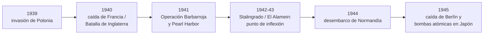

# Los fascismos, la Segunda Guerra y el Holocausto

```{admonition} Bibliografía de referencia
:class: tip
- Procacci, G., *Historia general del siglo XX*. Barcelona, Crítica, 2005.
  Cap. 5, pto. 3, y cap. 13.
- Burrin, Ph., *Hitler y los judíos*. Buenos Aires, Ediciones de la Flor,
  1990. Introducción y cap. 6.
- Hobsbawm, E., *Historia del siglo XX*. Barcelona, Crítica, 1995. Cap. 1
  (revisión).
```

## 1. De un fascismo a "los fascismos"

El apunte de la unidad anterior sobre el fascismo italiano permite ahora
generalizar algunos rasgos comunes a los distintos movimientos de extrema
derecha que surgieron en Europa en el período de entreguerras, más allá de
sus enormes diferencias nacionales:

```{admonition} Rasgos comunes de los fascismos
:class: note
- Ultranacionalismo y culto a una comunidad nacional homogénea.
- Rechazo simultáneo del liberalismo parlamentario y del comunismo.
- Partido único y culto a un líder carismático.
- Estetización y militarización de la política de masas.
- Vocación expansionista y revisionismo frente a los tratados de paz de
  1919.
```

El nazismo alemán comparte buena parte de estos rasgos, pero añade un
componente que lo distingue de manera radical de sus pares: un
antisemitismo racial que terminará por convertirse en política de
exterminio sistemático.

## 2. La crisis de Weimar como caldo de cultivo

Alemania salió de la Primera Guerra Mundial con la humillación del
Tratado de Versalles —tratado en el apunte sobre las guerras mundiales— y
con una frágil república parlamentaria, la **República de Weimar**. La
hiperinflación de 1923, que licuó los ahorros de la clase media, y sobre
todo el impacto devastador de la crisis de 1929 —desarrollado en el
apunte anterior— dispararon un desempleo masivo que erosionó por completo
la legitimidad del sistema democrático.

## 3. Hitler y el Partido Nazi

En este contexto surgió el **Partido Nacionalsocialista Obrero Alemán**
(NSDAP), liderado por Adolf Hitler. Tras el fallido *Putsch* de la
cervecería de Múnich (1923), Hitler pasó una breve condena en prisión
durante la cual escribió *Mein Kampf*, donde expuso los ejes centrales de
su visión del mundo.

```{important}
Según Burrin, el antisemitismo de Hitler no fue una simple táctica
electoral, sino una **creencia central y consistente** que atravesó toda
su trayectoria política, desde sus primeros discursos hasta su testamento
político final. Sus elementos clave fueron el racismo, el antisemitismo,
la idea de una "comunidad nacional" (*Volksgemeinschaft*) racialmente
pura, el *Führerprinzip* (principio del líder), el rechazo del Tratado de
Versalles y, desde 1923, la conquista de un "espacio vital" (*Lebensraum*)
en el este de Europa.
```

## 4. La conquista del poder (1933)

Beneficiado por el descontento social de la crisis del 29, el NSDAP se
convirtió en el partido más votado en las elecciones de 1932. En enero de
1933, el presidente Hindenburg nombró a Hitler canciller. El incendio del
Reichstag, apenas un mes después, sirvió de pretexto para suspender
garantías constitucionales, y la **Ley Habilitante** de marzo de 1933 le
otorgó poderes casi absolutos. Tras la muerte de Hindenburg en 1934,
Hitler concentró en su persona la jefatura de Estado y de gobierno bajo el
título de *Führer*.

```{admonition} La construcción del Estado totalitario nazi
:class: important
- Supresión de todos los partidos salvo el NSDAP y de los sindicatos
  independientes.
- Las **Leyes de Núremberg** (1935) privaron a los judíos alemanes de la
  ciudadanía y prohibieron los matrimonios y relaciones con "arios".
- Uso masivo de la propaganda (a cargo de Joseph Goebbels) y control
  total de la cultura y la educación.
- La **Noche de los Cristales Rotos** (noviembre de 1938): pogromo
  organizado contra comercios, sinagogas y hogares judíos en toda
  Alemania, antesala de la persecución sistemática que vendría después.
```

## 5. La Guerra Civil española como preludio (1936-1939)

El levantamiento del general Francisco Franco contra la Segunda República
española, en 1936, se transformó rápidamente en un conflicto de alcance
internacional: Alemania e Italia enviaron tropas y armamento en apoyo de
Franco (el bombardeo de Guernica por la Legión Cóndor alemana es el
episodio más recordado), mientras la Unión Soviética apoyó al bando
republicano. La guerra funcionó, en los hechos, como un **campo de
pruebas** para las tácticas militares y las alianzas que definirían la
Segunda Guerra Mundial.

## 6. El camino a la guerra: expansión y apaciguamiento

Entre 1936 y 1939, Hitler fue desafiando progresivamente el orden de
Versalles: la remilitarización de Renania (1936), la anexión de Austria o
*Anschluss* (marzo de 1938) y la ocupación de los Sudetes checoslovacos,
esta última convalidada por Gran Bretaña y Francia en los **Acuerdos de
Múnich** (septiembre de 1938) mediante una política de **apaciguamiento**
que buscaba, sin éxito, evitar una nueva guerra general.

```{note}
El apaciguamiento solo alentó nuevas exigencias: en 1939 Alemania ocupó el
resto de Checoslovaquia y, tras firmar el **Pacto Ribbentrop-Mólotov** con
la URSS (que incluía el reparto secreto de Polonia), invadió Polonia el 1°
de septiembre de 1939. Gran Bretaña y Francia le declararon la guerra dos
días después: comenzaba así la Segunda Guerra Mundial.
```

## 7. El curso de la guerra



La guerra combinó, como ya se señaló al tratar sus rasgos generales, la
movilización total de las sociedades beligerantes con una tecnología de
destrucción sin precedentes. La invasión alemana de la URSS en 1941 (ya
descripta en el apunte sobre la Revolución Rusa y sus avatares) abrió el
frente más sangriento del conflicto, y su fracaso en Stalingrado marcó,
junto con la derrota italo-alemana en el norte de África, el comienzo del
repliegue del Eje. La entrada de Estados Unidos tras el ataque japonés a
Pearl Harbor (diciembre de 1941) globalizó definitivamente la guerra. El
desembarco aliado en Normandía (junio de 1944) abrió el frente occidental
decisivo, y la guerra terminó en Europa con la caída de Berlín en mayo de
1945, y en el Pacífico con los bombardeos atómicos sobre Hiroshima y
Nagasaki en agosto del mismo año.

## 8. El Holocausto

La ocupación alemana de Europa oriental a partir de 1941 permitió pasar de
la persecución a la **exterminación sistemática**. Unidades móviles de
exterminio (los *Einsatzgruppen*) comenzaron a fusilar masivamente a la
población judía en los territorios ocupados de la URSS y Polonia. En enero
de 1942, la **Conferencia de Wannsee** coordinó a nivel estatal la
llamada **"Solución Final"**: la deportación sistemática de los judíos de
toda Europa hacia campos de exterminio —Auschwitz-Birkenau, Treblinka,
Sobibor, entre otros— equipados con cámaras de gas para el asesinato en
masa.

```{important}
El resultado fue el asesinato sistemático de unos **seis millones de
judíos europeos**, junto con millones de víctimas adicionales: población
romaní, personas con discapacidad, prisioneros de guerra soviéticos,
opositores políticos y otros grupos considerados "indeseables" por la
ideología nazi. Burrin subraya que este desenlace no fue un exceso
improvisado de la guerra, sino la consecuencia directa y coherente de la
visión del mundo que Hitler sostuvo desde los años veinte.
```

## 9. Balance: guerra total y genocidio

La Segunda Guerra Mundial confirmó y llevó al extremo los rasgos de
"guerra total" ya identificados para la Primera Guerra Mundial: la
movilización íntegra de las sociedades, la industrialización de la
destrucción y la disolución de la frontera entre combatientes y civiles.
Pero incorporó, además, una dimensión sin precedente: la planificación
burocrática e industrial de un genocidio. Al finalizar la guerra, los
juicios de Núremberg (1945-1946) juzgaron a los principales responsables
nazis y consolidaron la noción de "crímenes contra la humanidad" en el
derecho internacional, mientras el mundo quedaba dividido entre las dos
superpotencias que emergerían de la contienda —Estados Unidos y la
URSS—, escenario que se desarrolla en la unidad siguiente.

## Glosario para repasar

Ley Habilitante
: Ley de marzo de 1933 que otorgó a Hitler poderes de gobierno casi
  absolutos, pilar legal de la dictadura nazi.

Leyes de Núremberg
: Legislación de 1935 que privó a los judíos alemanes de la ciudadanía y
  prohibió su mezcla legal y social con la población "aria".

Apaciguamiento
: Política de concesiones de Gran Bretaña y Francia frente a las
  exigencias territoriales de Hitler entre 1936 y 1938, que no logró
  evitar la guerra.

Einsatzgruppen
: Unidades móviles de exterminio nazis que fusilaron masivamente a
  población judía y otros grupos en los territorios ocupados del este de
  Europa a partir de 1941.

Conferencia de Wannsee
: Reunión de enero de 1942 en la que altos funcionarios nazis coordinaron
  la "Solución Final", el plan de exterminio sistemático de los judíos de
  Europa.

Solución Final
: Nombre nazi para el plan de exterminio industrial y sistemático de la
  población judía europea, ejecutado en campos como Auschwitz-Birkenau y
  Treblinka.
