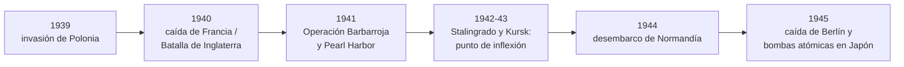

# Los fascismos, la Segunda Guerra y el Holocausto

```{admonition} Bibliografía de referencia
:class: tip
- Procacci, G., *Historia general del siglo XX*. Barcelona, Crítica, 2005.
  Cap. 5, pto. 3, y cap. 13, "La Alemania nazi".
- Burrin, Ph., *Hitler y los judíos. Génesis de un genocidio*. Buenos
  Aires, Ediciones de la Flor, 1990. Introducción y cap. 6.
- Hobsbawm, E., *Historia del siglo XX*. Barcelona, Crítica, 1995. Cap. 1
  (revisión).
```

## 1. De un fascismo a "los fascismos"

El apunte de la unidad anterior sobre el fascismo italiano permite ahora
generalizar algunos rasgos comunes a los distintos movimientos de extrema
derecha que surgieron en Europa en el período de entreguerras, más allá de
sus enormes diferencias nacionales:

```{admonition} Rasgos comunes de los fascismos
:class: note
- Ultranacionalismo y culto a una comunidad nacional homogénea.
- Rechazo simultáneo del liberalismo parlamentario y del comunismo.
- Partido único y culto a un líder carismático.
- Estetización y militarización de la política de masas.
- Vocación expansionista y revisionismo frente a los tratados de paz de
  1919.
```

El nazismo alemán comparte buena parte de estos rasgos, pero añade un
componente que lo distingue de manera radical de sus pares: un
antisemitismo racial que terminará por convertirse en política de
exterminio sistemático.

## 2. La crisis de Weimar como caldo de cultivo

Alemania salió de la Primera Guerra Mundial con la humillación del
Tratado de Versalles —tratado en el apunte sobre las guerras mundiales— y
con una frágil república parlamentaria, la **República de Weimar**. La
hiperinflación de 1923, que licuó los ahorros de la clase media, y sobre
todo el impacto devastador de la crisis de 1929 —desarrollado en el
apunte anterior— dispararon un desempleo masivo que erosionó por completo
la legitimidad del sistema democrático.

```{note}
La crisis del 30 fue determinante. Alemania llegó a tener unos cuatro
millones de desocupados, con ollas populares y hambre en las ciudades, y
la sensación generalizada de que el mundo conocido se derrumbaba. Los
nazis supieron capitalizar ese clima de desesperación mejor que ninguna
otra fuerza política.
```

## 3. Hitler y el Partido Nazi

### 3.1 De Viena a la trinchera

Adolf Hitler nació en Austria en 1889. Dejó su pueblo natal para
instalarse en Viena, capital del Imperio austrohúngaro, con la intención
de estudiar arte y arquitectura, pero fue rechazado dos veces por la
Academia de Bellas Artes. Tras la muerte de su madre, que lo había
sostenido económicamente, vivió varios años en situación de pobreza
extrema.

En 1914 se enroló como voluntario en el ejército bávaro. No combatió como
soldado de primera línea sino como **enlace o mensajero**, una tarea de
trinchera a trinchera considerada muy peligrosa, por la que fue
condecorado. En octubre de 1918 resultó herido por gas venenoso y se
estaba recuperando en un hospital cuando le informaron que Alemania se
había rendido.

```{important}
Ese momento es decisivo para entender su trayectoria posterior. El Alto
Mando había sostenido ante la población la ficción de que Alemania iba
ganando —no se había disparado un solo tiro en territorio alemán—, de modo
que la capitulación se vivió como una traición inexplicable. Hitler
elaboró allí la convicción de que el país había sido apuñalado por la
espalda por judíos y marxistas, a quienes tomaba como sinónimos. La
*Dolchstoßlegende* dejó de ser propaganda militar y se volvió, en su caso,
una **obsesión existencial**: la explicación de todo.
```

### 3.2 El ingreso a la política y el Putsch de 1923

Al salir del hospital, Hitler permaneció en el ejército en tareas de
inteligencia política: se infiltraba en reuniones y redactaba informes.
Su superior, el capitán Karl Mayr, le acercó material nacionalista y
antisemita que terminó de moldear su pensamiento. En 1919, cumpliendo una
de esas misiones, asistió a una reunión del **Partido Obrero Alemán**
(*Deutsche Arbeiterpartei*, DAP) en una cervecería de Múnich; tomó la
palabra y su capacidad de oratoria impresionó a los presentes, que lo
reclutaron de inmediato. En 1920 el partido pasó a llamarse **Partido
Nacionalsocialista Obrero Alemán** (NSDAP).

Durante esos primeros años Hitler fue, ante los empresarios y los
periodistas, apenas un **agitador** eficaz —la llamada "etapa del
tambor"—, no todavía el líder que esos sectores buscaban. En noviembre de
1923 intentó dar el salto: emulando la Marcha sobre Roma de Mussolini,
encabezó en Múnich un intento de golpe conocido como el **Putsch de la
Cervecería**, que la policía interceptó a tiros dejando una veintena de
muertos.

```{note}
El fracaso tuvo una enseñanza que Hitler no olvidó: a diferencia de
Italia, en Alemania no había clima para tomar el poder por la fuerza
bruta. A partir de entonces buscaría la vía formalmente legal.
```

En el juicio de 1924 Hitler se defendió a sí mismo y convirtió el banquillo
en una tribuna política, lo que le valió la simpatía de los jueces, de
sectores ultranacionalistas y de parte de la oligarquía, que a partir de
ahí empezó a financiarlo. Condenado a cinco años, cumplió apenas nueve
meses. En la cárcel escribió ***Mein Kampf*** (*Mi lucha*), un texto de
escritura deliberadamente sencilla, organizado en torno a dos ejes:

- El **odio antisemita**, con un lenguaje sistemáticamente
  deshumanizante: los judíos como parásitos, insectos, ratas, microbios.
- El **proyecto expansionista hacia el Este**, donde se encontraban a la
  vez los marxistas —que identificaba con los judíos— y las tierras
  necesarias para el "espacio vital" (*Lebensraum*) alemán.

### 3.3 De agitador a Führer

Al salir de prisión, en 1925, Hitler ya no se presentó como agitador sino
como el **Führer**: el hombre providencial que haría grande a Alemania. Su
popularidad seguía circunscripta, por entonces, a Múnich y Baviera.

El partido se organizó en torno a tres cuerpos, que conviene no confundir:

```{admonition} SA, SS y SD
:class: important
- **SA** (*Sturmabteilung*): el grupo de choque del partido, encargado de
  reventar las reuniones socialistas y de ejercer la violencia callejera.
  Liderado por Ernst Röhm.
- **SS** (*Schutzstaffel*): cuerpo militarizado de élite, surgido después,
  encargado de la custodia del líder. Liderado por Heinrich Himmler.
- **SD** (*Sicherheitsdienst*): servicio de contrainteligencia del
  partido, destinado a detectar infiltrados.
```

### 3.4 El crecimiento electoral (1928-1933)

Con Joseph Goebbels al frente de la propaganda, el partido pasó de ser
una fuerza marginal a la primera minoría del país en apenas cuatro años:

| Elección | Resultado del NSDAP |
| --- | --- |
| Mayo de 1928 | 2,6% |
| Septiembre de 1930 | ≈ 18% |
| Julio de 1932 | ≈ 37% |
| Marzo de 1933 | 43,9% (ya con Hitler canciller) |

```{note}
La frecuencia de las elecciones no es casual: Alemania era un sistema
parlamentario y se convocaba a elecciones cada vez que caía un canciller,
algo cada vez más habitual a medida que la crisis volvía ingobernable al
Reichstag.
```

Un dato importante sobre la **interna del partido**: durante la crisis, su
ala izquierda sostenía que el capitalismo estaba condenado y presionaba
por medidas anticapitalistas —estatización de la banca, nacionalización de
las grandes empresas—. A Hitler le interesaba en cambio tener a los
empresarios de su lado, de modo que terminó desplazando a ese sector. La
promesa que llevó a las urnas no fue la transformación social sino la
**expansión hacia el Este**: conquistar territorios en Rusia y reducir a
sus poblaciones —eslavos, judíos, marxistas— a la condición de siervos al
servicio del pueblo alemán.

## 4. La conquista del poder (1933-1934)

El **30 de enero de 1933**, en plena crisis, el presidente Hindenburg
nombró canciller a Hitler. Lo que siguió fue una demolición acelerada del
orden constitucional:

- **27 de febrero de 1933**: el **incendio del Reichstag**, atribuido a
  socialistas y comunistas, sirvió de pretexto para suspender las
  garantías constitucionales y abrir los primeros **campos de
  concentración**, destinados en esta etapa a los opositores políticos.
- **5 de marzo de 1933**: con el aparato estatal ya en sus manos y la
  oposición perseguida, el NSDAP obtuvo el 43,9% de los votos.
- **Marzo de 1933**: la **Ley Habilitante** otorgó al gobierno poderes
  legislativos casi absolutos.
- Supresión de todos los partidos salvo el NSDAP y de los sindicatos
  independientes; prohibición de la libertad de prensa. Se distribuyó
  además una radio barata a cada familia para asegurar la llegada directa
  de la propaganda.

### 4.1 La Noche de los cuchillos largos (1934)

Para su proyecto expansionista Hitler necesitaba el apoyo del Ejército
(*Wehrmacht*), y el Ejército puso un precio: el **monopolio de las
armas**, incompatible con la existencia de una milicia partidaria de
millones de miembros como las SA.

En la madrugada del **30 de junio de 1934**, Hitler ordenó el asesinato de
Ernst Röhm y de la plana mayor de las SA, aprovechando la ocasión para
eliminar también a otros rivales internos y externos. A cambio, el
Ejército le juró fidelidad personal. Poco después, el **2 de agosto de
1934**, murió Hindenburg; un plebiscito convalidó con cerca del 90% de los
votos —una cifra que el propio régimen había vuelto imposible de
verificar— la unificación de los cargos de canciller y presidente en la
figura del *Führer*.

### 4.2 Los cuatro pilares del régimen

```{admonition} La lectura de Ian Kershaw
:class: important
Kershaw describe al régimen nazi como una dictadura de ultraderecha
sostenida sobre cuatro pilares —la **burocracia estatal**, el **Partido
Nazi**, el **Ejército** y el propio **Hitler**—, organizados como un
sistema solar en el que Hitler era el sol y todo lo demás giraba a su
alrededor. La imagen es útil porque explica dos cosas a la vez: la
centralidad absoluta del líder y el hecho de que el régimen no fuera un
bloque monolítico, sino un campo de competencia permanente entre
instancias rivales.
```

## 5. La persecución de los judíos antes de la guerra

El régimen se radicalizó de manera progresiva, empujado por los sectores
del partido que exigían medidas contra los judíos.

- **1935 — Leyes de Núremberg**: definieron jurídicamente quién era judío,
  les quitaron la ciudadanía y sus derechos, los expulsaron del empleo
  público y presionaron a los privados para que hicieran lo mismo.
- **Noviembre de 1938 — Noche de los Cristales Rotos**: pogromo
  organizado contra comercios, sinagogas y hogares judíos en toda
  Alemania.

```{important}
Un punto clave, y fácil de confundir: hasta 1941 el objetivo declarado del
régimen fue el **alejamiento** de los judíos del territorio, no su
exterminio. La primera expectativa fue que emigraran por su cuenta ante el
hostigamiento; luego se barajaron planes de deportación masiva. El más
conocido es el **plan Madagascar** (1940), que contemplaba enviar a los
judíos europeos a esa colonia francesa tras la caída de Francia, y que
nunca se concretó porque la guerra con Gran Bretaña continuaba y Alemania
no controlaba las rutas marítimas. Tampoco era viable Palestina, bajo
control británico. **Los planes de expulsión fracasaron uno a uno**, y ese
fracaso es parte esencial de la explicación de lo que vino después.
```

```{note}
La obligación de llevar la estrella de David cosida a la ropa suele
asociarse a las Leyes de Núremberg, pero en Alemania se impuso recién en
**septiembre de 1941**, ya en plena guerra y en vísperas de las primeras
deportaciones masivas.
```

## 6. La Guerra Civil española como preludio (1936-1939)

El levantamiento del general Francisco Franco contra la Segunda República
española, en 1936, se transformó rápidamente en un conflicto de alcance
internacional: Alemania e Italia enviaron tropas y armamento en apoyo de
Franco (el bombardeo de Guernica por la Legión Cóndor alemana es el
episodio más recordado), mientras la Unión Soviética apoyó al bando
republicano. La guerra funcionó, en los hechos, como un **campo de
pruebas** para las tácticas militares y las alianzas que definirían la
Segunda Guerra Mundial.

## 7. El camino a la guerra: expansión y apaciguamiento

Entre 1936 y 1939, Hitler fue desafiando progresivamente el orden de
Versalles:

- **1936**: anuncio del **rearme**, en abierta violación del tratado, y
  **remilitarización de Renania**, la franja fronteriza con Francia que
  Versalles había declarado desmilitarizada. Francia y Gran Bretaña no
  reaccionaron: no querían otra guerra y buena parte de su dirigencia
  consideraba que Versalles había sido excesivamente duro.
- **1936-1937 — Pacto Anti-Komintern**: Alemania, Japón e Italia firman un
  acuerdo de lucha contra el comunismo internacional que refleja, en el
  fondo, intereses expansionistas convergentes en distintas regiones del
  mundo (el futuro eje Berlín-Roma-Tokio).
- **Marzo de 1938 — *Anschluss***: Hitler entra en Austria, prohibido por
  Versalles, y es recibido sin resistencia.
- **Septiembre de 1938 — los Sudetes**: Alemania reclama esa región de
  Checoslovaquia, de población germanohablante, separada de Alemania por
  Versalles. En los **Acuerdos de Múnich**, el primer ministro británico
  Neville Chamberlain y el jefe del gobierno francés Édouard Daladier se
  la conceden a cambio del compromiso de no ocupar más territorios: es la
  política de **apaciguamiento**.

```{note}
El apaciguamiento solo alentó nuevas exigencias: en marzo de 1939 Alemania
ocupó el resto de Checoslovaquia y acto seguido presionó a Polonia por el
**corredor de Dánzig**, el pasillo que separaba a Prusia Oriental del
resto del Reich. Polonia, a diferencia de Checoslovaquia, tenía un tratado
de asistencia mutua con Gran Bretaña y Francia.
```

El último movimiento previo a la guerra fue el más inesperado: en **agosto
de 1939**, la Alemania nazi y la URSS —enemigos ideológicos
irreconciliables— firmaron el **Pacto Ribbentrop-Mólotov** de no agresión,
cuyas cláusulas secretas repartían Polonia entre ambos y dejaban a la URSS
las manos libres en Estonia, Letonia, Lituania y Finlandia. Hitler se
aseguraba así evitar la guerra en dos frentes que había perdido el Imperio
en 1918.

## 8. El curso de la guerra


```mermaid
graph LR
    A["1939<br/>invasión de Polonia"] --> B["1940<br/>caída de Francia /<br/>Batalla de Inglaterra"]
    B --> C["1941<br/>Operación Barbarroja<br/>y Pearl Harbor"]
    C --> D["1942-43<br/>Stalingrado y Kursk:<br/>punto de inflexión"]
    D --> E["1944<br/>desembarco de Normandía"]
    E --> F["1945<br/>caída de Berlín y<br/>bombas atómicas en Japón"]
```

### 8.1 Polonia y la guerra relámpago (1939)

El **1° de septiembre de 1939** Alemania invadió Polonia; dos días después
Gran Bretaña y Francia le declararon la guerra. El 17 de septiembre la
URSS invadió por el este y Polonia, atrapada entre dos fuegos, quedó
derrotada en cuestión de semanas.

```{admonition} La *Blitzkrieg* o guerra relámpago
:class: important
La táctica alemana consistía en avanzar con columnas de tanques a máxima
velocidad, sin esperar a la infantería, con apoyo de aviación. No era solo
una innovación militar: era una **necesidad estructural**. Escarmentada
por el desgaste de la Primera Guerra y carente de hierro y petróleo
propios, Alemania no estaba en condiciones de sostener un conflicto largo.
Su única guerra posible era una guerra corta.
```

Entre octubre de 1939 y mayo de 1940 el frente occidental quedó
prácticamente inmóvil, en el período que los contemporáneos bautizaron
como la "guerra de broma" (*drôle de guerre*).

### 8.2 La caída de Francia (1940)

En abril de 1940 Alemania ocupó Dinamarca y Noruega; el 10 de mayo invadió
Bélgica y los Países Bajos. Los mandos alemanes habían propuesto atacar
Francia por Bélgica, pero Hitler optó por hacer pasar el grueso de los
blindados por el **bosque de las Ardenas**, terreno que el mando francés
consideraba intransitable y por eso mismo había dejado mal defendido. En
poco más de un mes Francia se rindió: Alemania ocupó París y dos tercios
del territorio, y en el tercio restante quedó un gobierno colaboracionista
que conservó el control de las colonias francesas.

```{note}
En Dunkerque, unos 340.000 soldados británicos y franceses lograron ser
evacuados a Inglaterra en una operación improvisada con toda clase de
embarcaciones civiles. Hitler no los aniquiló con su aviación: mantenía la
esperanza de llegar a un acuerdo con Gran Bretaña, a la que consideraba
racialmente "igual" y no inferior. Fue un error de cálculo: Churchill se
negó a negociar.
```

La **Batalla de Inglaterra** (julio-octubre de 1940), una campaña masiva de
bombardeos aéreos sobre territorio británico, no logró doblegar al único
enemigo que quedaba en pie en occidente.

### 8.3 La Operación Barbarroja (1941)

Para junio de 1941, con Gran Bretaña invicta, los mariscales presentaron a
Hitler dos planes alternativos:

- **León Marino**: la invasión de Gran Bretaña por mar, extremadamente
  costosa frente a la mayor flota del mundo.
- **Operación Barbarroja**: la invasión de la URSS, en la dirección del
  proyecto expansionista hacia el Este, rompiendo el pacto firmado dos
  años antes.

Hitler eligió Barbarroja. Los alemanes avanzaron enormes distancias,
tomaron millones de prisioneros y llegaron casi hasta Moscú, pero el
invierno, las distancias y la resistencia soviética frenaron el avance. En
el verano de 1942 lanzaron una segunda gran ofensiva, esta vez hacia el
sur.

### 8.4 Pearl Harbor y la guerra del Pacífico (1941)

En el Pacífico, Estados Unidos y Japón competían por el control de la
región. Cuando Alemania derrotó a Francia, el gobierno colaboracionista
francés cedió **Indochina** (el actual Vietnam) a Japón. Estados Unidos
respondió con un **embargo petrolero** que dejaba a Japón con meses de
combustible.

En ese contexto, el **7 de diciembre de 1941** Japón atacó la base naval
de **Pearl Harbor**, en Hawái. El objetivo era destruir los portaaviones
estadounidenses, pero estos habían sido retirados de la base días antes y
el golpe no alcanzó su propósito principal. Estados Unidos entró en la
guerra y Alemania le declaró la guerra pocos días después.

```{note}
Existe una discusión, imposible de saldar documentalmente, sobre si
Roosevelt tenía información previa del ataque y lo dejó ocurrir. Lo que sí
está claro es el problema político que resolvió: la opinión pública
estadounidense era mayoritariamente contraria a entrar en la guerra, y
Pearl Harbor le dio al presidente el consenso que no tenía.
```

### 8.5 Stalingrado y Kursk: el punto de inflexión

En 1942 Hitler desistió de avanzar nuevamente sobre Moscú y concentró sus
fuerzas en tomar **Stalingrado**. La elección no era solo estratégica: la
ciudad llevaba el nombre del líder soviético, lo que convertía su conquista
en un objetivo político de primer orden.

La batalla fue de una brutalidad extrema y se libró casa por casa, en
condiciones que evidenciaban la desvalorización radical de la vida humana
en ambos bandos. Pese a que los alemanes llegaron a controlar buena parte
de la ciudad, no lograron la rendición soviética: entre enero y febrero de
1943 el ejército del mariscal **Friedrich von Paulus** quedó rodeado y
capituló. Fue **la primera gran derrota del Tercer Reich**. La siguió, en
julio de 1943, la enorme batalla de tanques de **Kursk**, tras la cual el
repliegue alemán en el frente oriental ya no se detuvo.

```{important}
A partir de esas dos derrotas, los líderes del mundo sabían que Alemania
había perdido la guerra, aunque el conflicto se prolongaría casi dos años
más. Conviene retener una proporción: de los aproximadamente **55 millones
de muertos** que dejó la guerra, unos **27 millones fueron soviéticos**.
Entre 1941 y 1944, el Ejército Rojo fue prácticamente el único que
enfrentó a las fuerzas alemanas en tierra en Europa.
```

### 8.6 El avance aliado y la caída del Tercer Reich

Mientras los soviéticos avanzaban desde el este, los aliados occidentales
desembarcaron en **Sicilia** en 1943 y continuaron por la península
italiana, aunque su avance fue lento: los alemanes habían trazado
sucesivas líneas defensivas a lo ancho de la península. El frente decisivo
en occidente se abrió recién en junio de 1944 con el **desembarco de
Normandía**, que obligó a Alemania a combatir otra vez en dos frentes
simultáneos.

```{note}
La cinematografía occidental tiende a atribuir la victoria a Estados
Unidos, pero fueron los soviéticos quienes aniquilaron el grueso de las
defensas alemanas y tomaron Berlín, soportando además el mayor costo en
vidas.
```

Ante la inminencia de la derrota, y tras enterarse del linchamiento
público de Mussolini, Hitler se suicidó en su búnker el **30 de abril de
1945** junto a Eva Braun, con quien se había casado el día anterior.
Alemania firmó su **rendición incondicional el 8 de mayo de 1945**.

### 8.7 El Pacífico y las bombas atómicas (1945)

Entre 1942 y 1943 Estados Unidos consiguió la supremacía naval en el
Pacífico a través de sucesivas batallas aeronavales. Desde 1944 comenzó la
invasión de las islas próximas al archipiélago japonés, con una resistencia
feroz: los soldados japoneses tenían orden de no rendirse y los
**kamikazes** se lanzaban en vuelos suicidas contra los barcos enemigos.
Las bajas estadounidenses fueron tan altas —sobre todo en Okinawa— que
comenzó a crecer la presión interna para negociar la paz.

Ante el cálculo de que invadir el territorio japonés costaría aún más
vidas, el presidente **Harry Truman** autorizó el lanzamiento de dos bombas
atómicas: sobre **Hiroshima el 6 de agosto** y sobre **Nagasaki el 9 de
agosto de 1945**. Japón anunció su rendición el 15 de agosto. Estados
Unidos ocupó el país e instaló un sistema liberal, conservando sin embargo
la figura del Emperador.

```{admonition} Tres lecturas sobre el uso de la bomba
:class: note
1. **La justificación oficial**: evitar el costo en vidas de una invasión
   terrestre del archipiélago.
2. **La hipótesis soviética**: la rendición japonesa pudo haberse
   precipitado tanto o más por la entrada de la URSS en la guerra del
   Pacífico, el 8 de agosto de 1945, entre ambas bombas.
3. **La lectura geopolítica**: las bombas fueron también una advertencia
   dirigida a la URSS, inaugurando la lógica de la Guerra Fría que se
   desarrolla en la unidad siguiente.
```

## 9. El Holocausto

Entre fines de 1941 y comienzos de 1942, el régimen nazi implementó la
llamada **"Solución Final"**: un plan sistemático e industrializado de
exterminio que terminó con el asesinato de unos **seis millones de
judíos**, además de cientos de miles de personas de otros grupos
considerados "indeseables" —población romaní, personas con discapacidad,
homosexuales, prisioneros de guerra soviéticos, opositores políticos—.

Unidades móviles de exterminio (los ***Einsatzgruppen***) comenzaron a
fusilar masivamente a la población judía en los territorios ocupados de la
URSS y Polonia. En enero de 1942, la **Conferencia de Wannsee** coordinó a
nivel estatal la deportación sistemática de los judíos de toda Europa
hacia campos de exterminio —Auschwitz-Birkenau, Treblinka, Sobibor, entre
otros— equipados con cámaras de gas.

### 9.1 El problema historiográfico: ¿cómo se llegó hasta ahí?

```{important}
La pregunta que organiza el libro de Burrin no es *qué* fue el exterminio
—eso la historiografía lo narró en profundidad— sino **cuál fue su
génesis**: qué trama de decisiones y coyunturas condujo al primer tren
hacia la muerte. Sus dos preguntas rectoras son: ¿la política del régimen
nazi debía desembocar necesariamente en el exterminio? ¿Era ese exterminio
un objetivo claro incluso para el propio Hitler?
```

La respuesta divide a la historiografía en dos grandes corrientes:

```{admonition} Intencionalismo y funcionalismo
:class: note
**Corriente intencionalista** (Bracher, Jäckel, Dawidowicz, Krausnick).
El exterminio fue la realización de un programa establecido por Hitler
desde los años veinte, que solo esperaba la ocasión de aplicarlo. Basta
leer *Mein Kampf* y sus declaraciones tempranas. Los retrocesos tácticos
—como el pacto germano-soviético de 1939— no serían más que desviaciones
momentáneas de un objetivo inflexible. Ubican el giro decisivo entre el
otoño de 1940 y la primavera de 1941.

**Corriente funcionalista** (Broszat, Mommsen, Schleunes). El Tercer Reich
era en realidad una "anarquía autoritaria": detrás de la fachada
monolítica coexistían fuerzas rivales —administración, ejército, partido,
SS— que obligaban al régimen a improvisar permanentemente. Hitler
orientaba esa competencia con sus discursos ideológicos, produciendo una
radicalización creciente, pero su papel era sobre todo **indirecto**.
Hasta 1941 el objetivo fue la expulsión, no el exterminio; la Solución
Final nació del encuentro entre la obsesión de Hitler, el funcionamiento
anárquico del régimen y una situación que se volvió inmanejable. Ubican el
giro en el otoño de 1941.
```

El desacuerdo no es caprichoso: responde a **enormes lagunas
documentales**. No existe ningún documento con una orden de exterminio
firmada por Hitler, ni testimonio escrito de tal orden. Las órdenes fueron
verbales y rodeadas de secreto, las conversaciones clave entre Hitler y
Himmler en 1941 permanecen opacas, y la propia expresión "Solución final"
cambió de significado con el tiempo.

### 9.2 La tesis de Burrin: la intención condicional

```{important}
Burrin propone una **síntesis** entre ambas corrientes:

- Como los **intencionalistas**, sostiene que Hitler alimentaba la
  intención de exterminar a los judíos.
- Pero esa intención no era absoluta sino **condicional**: debía aplicarse
  ante una situación bien definida —el fracaso de su proyecto de conquista
  mediante guerras relámpago y el retorno de una guerra larga y mundial
  que amenazara terminar en derrota—, lo que dejaba abierta otra política
  en el intervalo.
- Como los **funcionalistas**, sostiene que la **coyuntura fue esencial**:
  lo decisivo fue la percepción, en el otoño de 1941, del fracaso de la
  campaña de Rusia y de sus consecuencias estratégicas.
```

La base existencial de esa resolución fue la derrota de 1918. Los pasajes
más explosivos de *Mein Kampf* —donde Hitler imagina que someter a judíos
a gases venenosos habría salvado a millones de alemanes en el frente— no
formulan un plan futuro, sino una reinterpretación retrospectiva de la
derrota, a la vez propiciatoria y vengativa. Pero encierran, señala Burrin,
una resolución para el porvenir: una nueva guerra larga desencadenaría
medidas radicales. La potencialidad homicida del discurso de Hitler era
real, aunque sería abusivo inferir de ella una intencionalidad homicida
incondicional.

Cuando en el otoño de 1941 la campaña de Rusia fracasó —y con la entrada
de Estados Unidos el conflicto se volvió la guerra mundial y larga que
Hitler temía, coalición que atribuyó de inmediato a la acción de los
judíos—, esa resolución condicional se actualizó. Con esa decisión Hitler
reasumió la iniciativa que se le escapaba en el terreno militar.

### 9.3 Una decisión individual, una ejecución colectiva

La Solución Final fue una empresa en la que participaron innumerables
personas a través de Europa, del celo a la complicidad y del asentimiento
a la pasividad. Una vez lanzada, la maquinaria funcionó casi por inercia:
fue en gran parte un **crimen de burócratas**, cada uno concentrado en su
segmento de una cadena cuyo extremo era la muerte.

```{note}
Pero la responsabilidad no se diluye en esa maquinaria. Burrin subraya que
Hitler tenía la última palabra en materia de exterminio, y lo ilustra con
un caso documentado de mayo de 1942: cuando el gauleiter Greiser quiso
aplicar la misma suerte a 30.000 polacos enfermos de tuberculosis, el
ayudante de Himmler respondió que esa decisión solo podía tomarla el
Führer. De ahí el argumento contrafáctico de Burrin: si Hitler hubiera
muerto en el verano de 1941, el impulso decisivo habría faltado. En una
Europa dirigida por Goering, Goebbels o Himmler podría haber habido
segregación y violencias masivas, pero probablemente no genocidio.
```

Su antisemitismo, concluye Burrin, le había suministrado orientaciones y
resoluciones cuyo conjunto constituía **menos que un programa pero más que
una simple obsesión**.

## 10. Balance: guerra total, genocidio y juicio

La Segunda Guerra Mundial confirmó y llevó al extremo los rasgos de
"guerra total" ya identificados para la Primera Guerra Mundial: la
movilización íntegra de las sociedades, la industrialización de la
destrucción y la disolución de la frontera entre combatientes y civiles.
Pero incorporó, además, una dimensión sin precedente: la planificación
burocrática e industrial de un genocidio.

Concluida la guerra, los aliados organizaron los **Juicios de Núremberg**
(1945-1946) para juzgar a los principales responsables del nazismo. Aunque
el número de condenados fue reducido en relación con la magnitud de los
crímenes, sentaron un precedente decisivo en el derecho internacional: la
**responsabilidad individual** por crímenes de guerra y de lesa humanidad,
que ya no podía ampararse en la obediencia a órdenes superiores.

```{note}
Vale una advertencia sobre las otras víctimas del exterminio nazi. El
genocidio del pueblo **romaní (gitano)** fue, en términos proporcionales,
uno de los más devastadores, aunque sus cifras absolutas son menores y las
estimaciones mucho más inciertas por la ausencia de registros. Señalarlo no
minimiza la magnitud del Holocausto judío: subraya que el proyecto
exterminador nazi apuntó contra varios pueblos y colectivos a la vez.
```

Al terminar el conflicto, el mundo quedaba dividido entre las dos
superpotencias emergentes —Estados Unidos y la URSS—, escenario que se
desarrolla en la unidad siguiente.

## Glosario para repasar

Dolchstoßlegende
: "Leyenda de la puñalada por la espalda": el relato de que Alemania no
  fue derrotada militarmente en 1918 sino traicionada por judíos y
  marxistas desde la retaguardia. En Hitler dejó de ser propaganda para
  volverse el núcleo de su cosmovisión.

Lebensraum ("espacio vital")
: Proyecto de conquista de territorios en el Este europeo para el
  asentamiento alemán, con el sometimiento o la eliminación de sus
  poblaciones. Uno de los dos ejes de *Mein Kampf*.

SA, SS y SD
: Grupo de choque callejero (Röhm), cuerpo de élite y custodia del líder
  (Himmler) y servicio de contrainteligencia del partido,
  respectivamente.

Noche de los cuchillos largos
: Asesinato de Röhm y la cúpula de las SA el 30 de junio de 1934, precio
  que Hitler pagó al Ejército a cambio de su lealtad y del control del
  monopolio de las armas.

Ley Habilitante
: Ley de marzo de 1933 que otorgó a Hitler poderes de gobierno casi
  absolutos, pilar legal de la dictadura nazi.

Leyes de Núremberg
: Legislación de 1935 que definió jurídicamente quién era judío, lo privó
  de la ciudadanía y prohibió su mezcla legal y social con la población
  "aria".

Plan Madagascar
: Proyecto de 1940 de deportación masiva de los judíos europeos a esa
  colonia francesa. Su fracaso, junto al del resto de los planes de
  expulsión, forma parte del camino hacia la decisión de exterminio.

Apaciguamiento
: Política de concesiones de Gran Bretaña y Francia frente a las
  exigencias territoriales de Hitler entre 1936 y 1938, que no logró
  evitar la guerra.

Blitzkrieg (guerra relámpago)
: Táctica de avance rápido de blindados con apoyo aéreo, sin esperar a la
  infantería. Más que una elección doctrinaria, respondía a la
  imposibilidad alemana de sostener una guerra larga por falta de
  recursos.

Einsatzgruppen
: Unidades móviles de exterminio nazis que fusilaron masivamente a
  población judía y otros grupos en los territorios ocupados del este de
  Europa a partir de 1941.

Conferencia de Wannsee
: Reunión de enero de 1942 en la que altos funcionarios nazis coordinaron
  la "Solución Final", el plan de exterminio sistemático de los judíos de
  Europa.

Solución Final
: Nombre nazi para el plan de exterminio industrial y sistemático de la
  población judía europea, ejecutado en campos como Auschwitz-Birkenau y
  Treblinka.

Intencionalismo / funcionalismo
: Las dos grandes corrientes del debate historiográfico sobre la génesis
  del genocidio: un programa premeditado de Hitler frente a una
  radicalización improvisada del régimen.

Intención condicional
: Tesis de Burrin: Hitler albergaba la intención de exterminar a los
  judíos, pero sujeta a una condición —el fracaso de la guerra relámpago y
  el retorno de una guerra larga—, que se cumplió en el otoño de 1941.
