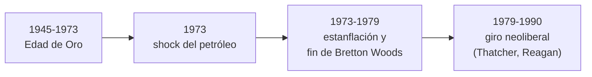

# El nuevo rostro de la sociedad moderna: transformaciones, prosperidad y crisis

```{admonition} Bibliografía de referencia
:class: tip
- Hobsbawm, E., *Historia del siglo XX*. Barcelona, Crítica, 1995. Caps.
  X y XI.
```



## 1. La "Edad de Oro" del capitalismo (1945-1973)

Los treinta años posteriores a la Segunda Guerra Mundial fueron, para el
mundo occidental (y también, con otro signo, para el bloque soviético
tratado en los apuntes anteriores), un período de crecimiento económico
sin precedentes históricos. Este auge se sostuvo en varios pilares
combinados:

```{admonition} Los pilares de la Edad de Oro
:class: important
- El sistema de **Bretton Woods** (1944): tipos de cambio fijos ancla dos
  al dólar, y la creación del FMI y el Banco Mundial para sostener la
  estabilidad financiera internacional.
- La consolidación del **Estado de bienestar**: seguridad social,
  educación y salud públicas, políticas de pleno empleo inspiradas en las
  ideas de Keynes.
- La maduración del **modelo fordista** de producción y consumo en masa,
  ya presentado en la primera unidad, que ahora se generaliza a escala
  social completa.
- El **baby boom** y una fuerte expansión demográfica y urbana en el
  mundo occidental.
```

## 2. La "revolución social" de posguerra

Hobsbawm dedica a este período lo que llama una verdadera **revolución
social**, tan profunda como cualquier revolución política, aunque mucho
menos visible en el corto plazo:

- El **declive del campesinado** como forma de vida mayoritaria en el
  mundo: por primera vez en la historia humana, la mayoría de la
  población mundial deja de vivir del trabajo agrario para concentrarse
  en ciudades.
- La **incorporación masiva de las mujeres al trabajo remunerado**, que
  transforma la estructura familiar tradicional y sienta las bases de
  las luchas feministas de las décadas siguientes.
- La **masificación de la educación media y universitaria**, que crea una
  nueva generación de jóvenes con expectativas y códigos culturales
  propios, diferenciados por primera vez de manera tan marcada del mundo
  adulto.
- Una **revolución cultural y de las costumbres**, asociada a la
  liberalización sexual, al surgimiento de una cultura juvenil de masas
  (música, moda, medios de comunicación) y a un cuestionamiento
  generalizado de la autoridad tradicional.

```{note}
Ese cuestionamiento generacional estalla, de manera casi simultánea y en
contextos políticos muy distintos, en **1968**: el Mayo Francés, el
movimiento por los derechos civiles y contra la guerra de Vietnam en
Estados Unidos, y la Primavera de Praga tratada en el apunte anterior son
expresiones, cada una a su modo, de una misma época de contestación
global.
```

## 3. Transformaciones culturales de masas

La expansión de la televisión y de los medios de comunicación de masas
homogeneizó buena parte del consumo cultural occidental, al tiempo que
convivía con una intensa renovación en las artes y una creciente tensión
entre alta cultura y cultura de masas, un debate que atraviesa buena parte
de la producción intelectual de la época sobre el lugar del arte en una
sociedad de consumo masivo.

## 4. El fin de la Edad de Oro: la crisis de 1973

El equilibrio de posguerra empezó a resquebrajarse a comienzos de la
década de 1970:

- En 1971, Estados Unidos abandonó unilateralmente la convertibilidad del
  dólar en oro, lo que en la práctica puso fin al sistema de Bretton
  Woods.
- En 1973, la guerra árabe-israelí del Yom Kipur llevó a los países
  productores de petróleo agrupados en la OPEP a decretar un embargo y a
  cuadruplicar el precio del crudo, generando el primer **shock
  petrolero** (un segundo shock se repetiría en 1979).

```{important}
Estos dos golpes combinados produjeron un fenómeno que la teoría económica
keynesiana no lograba explicar bien: la **estanflación**, es decir, la
coexistencia de estancamiento económico, desempleo creciente e inflación
alta al mismo tiempo. Esta anomalía abrió la puerta a un cuestionamiento
de fondo del consenso keynesiano de posguerra.
```

## 5. El giro neoliberal

Frente al agotamiento del modelo anterior, hacia fines de la década de
1970 y comienzos de la de 1980 se impuso en buena parte del mundo
occidental un nuevo consenso económico, asociado sobre todo a los
gobiernos de Margaret Thatcher en Gran Bretaña (desde 1979) y de Ronald
Reagan en Estados Unidos (desde 1981):

```{admonition} Rasgos del giro neoliberal
:class: note
- Prioridad al control de la inflación (**monetarismo**) por sobre el
  pleno empleo.
- Desregulación de los mercados financieros y laborales.
- Privatización de empresas y servicios públicos.
- Debilitamiento del poder de negociación de los sindicatos.
- Aceleración de la globalización económica y financiera.
```

## 6. Balance de fin de siglo

Las décadas finales del siglo XX combinaron, entonces, una prosperidad
material sin precedentes históricos —que la revolución tecnológica de la
informática empezaba a potenciar— con una creciente **desigualdad social**
y con la persistencia de las transformaciones culturales iniciadas en la
posguerra: diversificación de los modelos familiares, avances (desiguales
y disputados) en los derechos de las mujeres, y una creciente conciencia
sobre los límites ambientales del crecimiento económico. Este doble
movimiento de prosperidad y crisis es, en definitiva, el "nuevo rostro" de
la sociedad moderna que da nombre a este apunte.

## Glosario para repasar

Bretton Woods
: Sistema monetario internacional (1944-1971) de tipos de cambio fijos
  anclados al dólar, sostenido por el FMI y el Banco Mundial.

Edad de Oro
: Período de crecimiento económico excepcional en el mundo occidental
  entre 1945 y 1973, sostenido en el Estado de bienestar y el modelo
  fordista.

Estanflación
: Fenómeno económico de estancamiento y desempleo combinado con inflación
  alta, típico de la crisis de la década de 1970.

Shock petrolero
: Aumento abrupto del precio internacional del petróleo decretado por la
  OPEP en 1973 y 1979, que golpeó a las economías industrializadas
  importadoras de crudo.

Giro neoliberal
: Conjunto de políticas de desregulación, privatización y control de la
  inflación impulsadas desde fines de los años 70, asociadas sobre todo a
  los gobiernos de Thatcher y Reagan.
