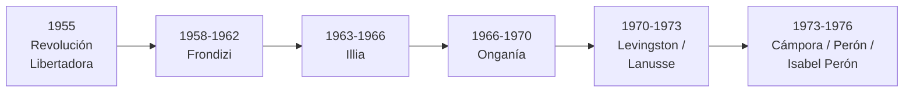

# América Latina y la Argentina: 1955-1976

```{admonition} Bibliografía de referencia
:class: tip
- Romero, L. A., *Breve historia contemporánea de la Argentina*. Buenos
  Aires, Fondo de Cultura Económica. Cap. VI.
```



## 1. La Revolución Libertadora y la proscripción del peronismo (1955-1958)

Tras el golpe de septiembre de 1955, el gobierno de facto encabezado por
el general Pedro Eugenio Aramburu prohibió al Partido Peronista, intervino
la CGT y borró toda referencia pública al peronismo (el decreto 4161/56
llegó a prohibir la sola mención del nombre de Perón o de Eva Perón). Esta
**proscripción del peronismo**, lejos de disolverlo, se convirtió en el
dato central de la política argentina durante casi dos décadas: ningún
gobierno pudo construir una legitimidad plena mientras excluyera por la
fuerza a la mayoría electoral que el peronismo seguía representando.

## 2. El desarrollismo de Frondizi (1958-1962)

Arturo Frondizi, de la Unión Cívica Radical Intransigente, llegó a la
presidencia en 1958 gracias, en gran medida, al apoyo tácito del voto
peronista proscripto (un pacto informal con el propio Perón desde su
exilio). Su gobierno impulsó el **desarrollismo**: atracción de
inversiones extranjeras, sobre todo en la industria automotriz, siderúrgica
y petrolera, con el objetivo de completar el proceso de sustitución de
importaciones iniciado en los años 30. Los polémicos contratos petroleros
con empresas extranjeras y una fuerte conflictividad sindical (el "Plan de
Lucha" de la CGT) desgastaron a un gobierno que, además, debió convivir
con presiones y vetos militares constantes, hasta ser finalmente derrocado
por las Fuerzas Armadas en 1962.

## 3. Illia y un nuevo veto militar (1963-1966)

El radical Arturo Illia asumió la presidencia en 1963 en elecciones donde
el peronismo siguió proscripto. Su gobierno, recordado por medidas como la
anulación de los contratos petroleros de Frondizi y por una gestión
austera y respetuosa de las formas institucionales, careció sin embargo de
una base de sustentación política amplia. En junio de 1966 fue derrocado
por un nuevo golpe militar.

## 4. La "Revolución Argentina": Onganía (1966-1970)

```{admonition} El régimen de Onganía
:class: important
El general Juan Carlos Onganía, que encabezó el golpe de 1966, disolvió
el Congreso, confiscó los bienes de los partidos políticos y clausuró la
vida política, buscando instaurar un **Estado fuerte y corporativo** que
superara lo que llamaba la "democracia burguesa". El gobierno intervino
las universidades por la fuerza —episodio conocido como la **"Noche de los
Bastones Largos"** (julio de 1966)—, provocando la renuncia y el exilio de
buena parte de la comunidad científica y académica del país.
```

El intento de modernización económica autoritaria de Onganía chocó con una
creciente resistencia social. En mayo de 1969, una protesta obrera y
estudiantil en la ciudad de Córdoba derivó en un levantamiento popular de
gran escala —el **Cordobazo**— que fue reprimido con dureza pero que
quebró definitivamente la autoridad del régimen y mostró los límites de
la salida autoritaria.

## 5. Levingston, Lanusse y la salida electoral (1970-1973)

Debilitado tras el Cordobazo, Onganía fue reemplazado por el general
Roberto Levingston (1970) y, poco después, por el general Alejandro
Agustín Lanusse (1971), quien impulsó el **Gran Acuerdo Nacional (GAN)**
para encauzar una transición ordenada hacia la democracia, convocando a
elecciones para 1973. El propio Perón seguía proscripto como candidato,
pero el peronismo pudo participar a través de un candidato propio,
**Héctor Cámpora**.

## 6. El regreso del peronismo (1973)

Cámpora ganó las elecciones de marzo de 1973 con la consigna que resumía
el momento: **"Cámpora al gobierno, Perón al poder"**. Asumió el 25 de
mayo, decretó una amnistía para los presos políticos y, apenas semanas
después, renunció para posibilitar un nuevo llamado a elecciones que
permitiera la candidatura de Perón.

```{note}
El regreso definitivo de Perón al país, en junio de 1973, estuvo marcado
por la **masacre de Ezeiza**: un violento enfrentamiento armado entre las
facciones de izquierda (la Tendencia Revolucionaria, con los Montoneros a
la cabeza) y de derecha del propio peronismo, que dejó en evidencia las
profundas divisiones internas del movimiento que Perón debería intentar
conducir en su tercera presidencia.
```

## 7. El tercer gobierno de Perón y la violencia política (1973-1974)

Perón ganó las elecciones de septiembre de 1973 con Isabel Martínez de
Perón, su esposa, como vicepresidenta. Su tercer gobierno debió lidiar con
una violencia política creciente entre organizaciones guerrilleras de
izquierda (Montoneros, ERP) y grupos parapoliciales de extrema derecha,
además de una economía cada vez más deteriorada. Perón murió en julio de
1974, dejando la presidencia en manos de Isabel.

## 8. Isabel Perón y la crisis terminal (1974-1976)

El gobierno de Isabel Perón, fuertemente influido por su secretario
privado José López Rega, profundizó la espiral de violencia: bajo el
amparo estatal actuó la **Triple A** (Alianza Anticomunista Argentina),
un grupo parapolicial responsable de numerosos asesinatos políticos. En
1975, una brusca devaluación y un fuerte ajuste conocido como el
**"Rodrigazo"** (por el ministro de Economía Celestino Rodrigo) dispararon
la inflación y agravaron el desorden económico. Entre la violencia
política, la crisis económica y la debilidad institucional del gobierno,
las condiciones quedaron dadas para un nuevo golpe militar, que se
concreta el 24 de marzo de 1976 y da comienzo al período tratado en el
próximo apunte de esta unidad.

## Glosario para repasar

Proscripción del peronismo
: Prohibición legal del Partido Peronista y de la candidatura de Perón,
  vigente entre 1955 y 1973, que condicionó toda la política argentina de
  ese período.

Noche de los Bastones Largos
: Intervención violenta de las universidades nacionales por parte del
  gobierno de Onganía en julio de 1966.

Cordobazo
: Levantamiento obrero y estudiantil en la ciudad de Córdoba en mayo de
  1969, que quebró la autoridad del gobierno de Onganía.

Masacre de Ezeiza
: Enfrentamiento armado entre facciones de izquierda y de derecha del
  peronismo durante el regreso de Perón al país en junio de 1973.

Triple A (Alianza Anticomunista Argentina)
: Organización parapolicial que actuó con amparo estatal durante el
  gobierno de Isabel Perón, responsable de numerosos asesinatos políticos.

Rodrigazo
: Fuerte devaluación y ajuste económico de 1975 que disparó la inflación
  y agravó la crisis final del gobierno de Isabel Perón.
