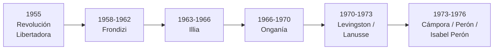

# América Latina y la Argentina: 1955-1976

```{admonition} Bibliografía de referencia
:class: tip
- Romero, L. A., *Breve historia contemporánea de la Argentina*. Buenos
  Aires, Fondo de Cultura Económica. Cap. VI.
```


```mermaid
graph LR
    A["1955<br/>Revolución<br/>Libertadora"] --> B["1958-1962<br/>Frondizi"]
    B --> C["1963-1966<br/>Illia"]
    C --> D["1966-1970<br/>Onganía"]
    D --> E["1970-1973<br/>Levingston /<br/>Lanusse"]
    E --> F["1973-1976<br/>Cámpora / Perón /<br/>Isabel Perón"]
```

## 1. La Revolución Libertadora y la proscripción del peronismo (1955-1958)

El general Eduardo Lonardi, que había encabezado el golpe, duró apenas dos
meses: su consigna de "ni vencedores ni vencidos" no contemplaba la
persecución sistemática del peronismo que exigía el sector más duro de las
fuerzas armadas. Fue desplazado en noviembre de 1955 por el general **Pedro
Eugenio Aramburu**, con el almirante Isaac Rojas como vicepresidente.

El nuevo gobierno de facto prohibió al Partido Peronista, intervino la CGT
y borró toda referencia pública al peronismo: el **decreto 4161/56** llegó
a prohibir la sola mención del nombre de Perón o de Eva Perón, la
exhibición de sus fotografías y la ejecución de la marcha partidaria. Los
militantes empezaron a identificarse entre sí con pequeñas flores
llamadas "no me olvides".

```{admonition} Tres decisiones de fondo de la "Libertadora"
:class: important
- **Los fusilamientos de junio de 1956.** Un levantamiento cívico-militar
  encabezado por el general Juan José Valle fue sofocado y respondido con
  el fusilamiento de militares y civiles peronistas, en buena medida fuera
  de todo marco legal. El episodio, reconstruido por Rodolfo Walsh en
  *Operación Masacre*, le valió al gobierno el apodo de "revolución
  fusiladora" y marcó el ingreso de la violencia política sin límites al
  repertorio del Estado argentino.
- **La anulación de la Constitución de 1949**, por proclama, y la
  convocatoria en 1957 a una convención constituyente con el peronismo
  proscripto. Perón ordenó votar en blanco desde el exilio y el voto en
  blanco resultó la primera minoría, deslegitimando de antemano a la
  convención, que solo alcanzó a incorporar el artículo 14 bis a la vieja
  Constitución de 1853.
- **El ingreso al Fondo Monetario Internacional** (1956), que inauguró un
  ciclo de endeudamiento externo del que el país ya no saldría.
```

```{note}
En 1957 el gobierno invitó a oficiales franceses —veteranos de Indochina y
Argelia— y luego a instructores norteamericanos a dictar cursos de **guerra
contrarrevolucionaria**. En un país donde entonces no existía ninguna
guerrilla, se enseñó allí una metodología de enemigo interno, inteligencia,
secuestro, tortura y desaparición que sería aplicada de manera sistemática
dos décadas más tarde, a partir de 1976.
```

Esta **proscripción del peronismo**, lejos de disolverlo, se convirtió en
el dato central de la política argentina durante casi dos décadas: ningún
gobierno pudo construir una legitimidad plena mientras excluyera por la
fuerza a la mayoría electoral que el peronismo seguía representando.

## 2. El desarrollismo de Frondizi (1958-1962)

Arturo Frondizi, de la Unión Cívica Radical Intransigente, llegó a la
presidencia en 1958 gracias, en gran medida, al voto peronista proscripto,
movilizado por un **pacto** con el propio Perón desde el exilio: a cambio
de que Perón ordenara votarlo, Frondizi se comprometía a liberar a los
presos políticos peronistas, levantar las causas abiertas contra Perón,
normalizar los sindicatos y la CGT y llamar a elecciones sin proscripción
en un plazo breve. Cumplió solo parcialmente —derogó el decreto 4161—, y
Perón terminó haciendo público el pacto, que Frondizi negó hasta su
muerte.

Su gobierno impulsó el **desarrollismo**: atracción de inversiones
extranjeras, sobre todo en la industria automotriz, siderúrgica y
petrolera, con el objetivo de completar el proceso de sustitución de
importaciones iniciado en los años 30.

```{note}
La **ley de inversiones extranjeras** ofrecía condiciones muy favorables al
capital externo y permitía la remisión de utilidades al exterior. En lo
inmediato equilibró la balanza de pagos con el ingreso de divisas; pero al
cabo de un par de años, cuando las empresas radicadas empezaron a girar
sus ganancias afuera, el déficit reapareció. Es un patrón que se repetirá
en la historia económica argentina.
```

Los polémicos contratos petroleros con empresas extranjeras y una fuerte
conflictividad sindical desgastaron a un gobierno que, además, debió
convivir con presiones y vetos militares constantes. El punto de ruptura
llegó en marzo de 1962, cuando Frondizi permitió al peronismo presentarse
en elecciones provinciales y este ganó en Buenos Aires: los militares
anularon los comicios y lo derrocaron, confinándolo en la isla Martín
García.

## 3. El interregno de Guido y la interna militar (1962-1963)

La salida fue una ficción institucional: asumió **José María Guido**,
presidente provisional del Senado, en aplicación de la ley de acefalía.
Guido cerró el Congreso y reinstaló el decreto 4161, que Frondizi había
derogado.

```{admonition} Azules y colorados
:class: important
Durante este gobierno el Ejército se enfrentó consigo mismo, dividido en
dos bandos que dirimieron sus diferencias con combates reales en 1962 y
1963:

- Los **azules** (legalistas o institucionalistas, con Juan Carlos Onganía
  a la cabeza), partidarios de encauzar al peronismo dentro de un sistema
  de partidos controlado, distinguiendo entre el peronismo como movimiento
  social y el comunismo.
- Los **colorados**, antiperonistas cerrados, que veían al peronismo como
  una forma local del comunismo y exigían su erradicación definitiva.

Militarmente ganaron los azules, pero en los hechos se impuso el objetivo
de los colorados: las elecciones de 1963 se celebraron con el peronismo
nuevamente proscripto.
```

## 4. Illia y un nuevo veto militar (1963-1966)

El radical Arturo Illia asumió la presidencia en 1963 en elecciones donde
el peronismo siguió proscripto, con alrededor de un cuarto de los votos; el
voto en blanco ordenado por Perón fue la segunda fuerza, lo que marcó al
gobierno desde el primer día con un problema de legitimidad de origen. Su
gestión, recordada por medidas como la anulación de los contratos
petroleros de Frondizi, la ley de medicamentos y un estilo austero y
respetuoso de las formas institucionales, careció sin embargo de una base
de sustentación política amplia y debió enfrentar el "Plan de Lucha" de la
CGT. En junio de 1966 fue derrocado por un nuevo golpe militar.

## 5. La "Revolución Argentina": Onganía (1966-1970)

```{admonition} El régimen de Onganía
:class: important
El general Juan Carlos Onganía, que encabezó el golpe de 1966, disolvió
el Congreso, confiscó los bienes de los partidos políticos y clausuró la
vida política, buscando instaurar un **Estado fuerte y corporativo** que
superara lo que llamaba la "democracia burguesa". El gobierno intervino
las universidades por la fuerza —episodio conocido como la **"Noche de los
Bastones Largos"** (julio de 1966)—, provocando la renuncia y el exilio de
buena parte de la comunidad científica y académica del país.
```

El intento de modernización económica autoritaria de Onganía chocó con una
creciente resistencia social. En mayo de 1969, una protesta obrera y
estudiantil en la ciudad de Córdoba derivó en un levantamiento popular de
gran escala —el **Cordobazo**— que fue reprimido con dureza pero que
quebró definitivamente la autoridad del régimen y mostró los límites de
la salida autoritaria.

## 6. Levingston, Lanusse y la salida electoral (1970-1973)

Debilitado tras el Cordobazo, Onganía fue reemplazado por el general
Roberto Levingston (1970) y, poco después, por el general Alejandro
Agustín Lanusse (1971), quien impulsó el **Gran Acuerdo Nacional (GAN)**
para encauzar una transición ordenada hacia la democracia, convocando a
elecciones para 1973.

En **noviembre de 1972**, tras diecisiete años de exilio, Perón regresó al
país por menos de un mes. No podía ser candidato —un requisito de
residencia fijado a medida se lo impedía—, pero alcanzó para lo esencial:
designó la fórmula que competiría en su nombre, **Héctor Cámpora y
Vicente Solano Lima**, y volvió a marcharse.

## 7. El regreso del peronismo (1973)

Cámpora ganó las elecciones de marzo de 1973 con casi el 50% de los votos
y con la consigna que resumía el momento: **"Cámpora al gobierno, Perón al
poder"**. Asumió el 25 de mayo, decretó una amnistía para los presos
políticos y, a los 49 días, renunció para posibilitar un nuevo llamado a
elecciones que permitiera la candidatura de Perón. Lo sucedió
interinamente **Raúl Lastiri**, presidente de la Cámara de Diputados.

```{note}
El regreso definitivo de Perón al país, en junio de 1973, estuvo marcado
por la **masacre de Ezeiza**: un violento enfrentamiento armado entre las
facciones de izquierda (la Tendencia Revolucionaria, con los Montoneros a
la cabeza) y de derecha del propio peronismo, que dejó en evidencia las
profundas divisiones internas del movimiento que Perón debería intentar
conducir en su tercera presidencia.
```

## 8. El tercer gobierno de Perón y la violencia política (1973-1974)

Perón ganó las elecciones del **23 de septiembre de 1973** con alrededor
del 62% de los votos y con Isabel Martínez de Perón, su esposa, como
vicepresidenta.

```{important}
Dos días después del triunfo, un comando de Montoneros asesinó a **José
Ignacio Rucci**, secretario general de la CGT. Rucci era una pieza clave
del esquema de Perón: garantizaba, por el lado de los trabajadores, el
**Pacto Social** entre sindicatos y empresarios sobre el que descansaba el
programa económico del gobierno. El atentado fue, en los hechos, una
declaración de guerra interna dentro del propio peronismo, y aceleró el
desplazamiento de Perón hacia los sectores de derecha del movimiento.
```

Su tercer gobierno debió lidiar con una violencia política creciente entre
organizaciones guerrilleras de izquierda (Montoneros, ERP) y grupos
parapoliciales de extrema derecha, además de una economía cada vez más
deteriorada. Perón murió el 1° de julio de 1974, dejando la presidencia en
manos de Isabel.

## 9. Isabel Perón y la crisis terminal (1974-1976)

El gobierno de Isabel Perón, fuertemente influido por su secretario
privado José López Rega, profundizó la espiral de violencia: bajo el
amparo estatal actuó la **Triple A** (Alianza Anticomunista Argentina),
un grupo parapolicial responsable de numerosos asesinatos políticos. En
1975, una brusca devaluación y un fuerte ajuste conocido como el
**"Rodrigazo"** (por el ministro de Economía Celestino Rodrigo) dispararon
la inflación y agravaron el desorden económico. Entre la violencia
política, la crisis económica y la debilidad institucional del gobierno,
las condiciones quedaron dadas para un nuevo golpe militar, que se
concreta el 24 de marzo de 1976 y da comienzo al período tratado en el
próximo apunte de esta unidad.

## Glosario para repasar

Proscripción del peronismo
: Prohibición legal del Partido Peronista y de la candidatura de Perón,
  vigente entre 1955 y 1973, que condicionó toda la política argentina de
  ese período.

Decreto 4161/56
: Norma de la "Revolución Libertadora" que prohibió toda mención pública
  del peronismo, incluidos los nombres de Perón y Eva Perón, sus imágenes
  y la marcha partidaria.

Fusilamientos de junio de 1956
: Ejecución de militares y civiles peronistas tras el levantamiento del
  general Valle, en buena medida al margen de la ley. Dieron lugar al
  apodo de "revolución fusiladora" y a *Operación Masacre*, de Rodolfo
  Walsh.

Pacto Perón-Frondizi
: Acuerdo de 1958 por el cual Perón ordenó votar a Frondizi a cambio de
  compromisos que este cumplió solo en parte, entre ellos el fin de la
  proscripción.

Azules y colorados
: Los dos bandos en que se dividió el Ejército entre 1962 y 1963:
  legalistas partidarios de integrar al peronismo en un sistema
  controlado, frente a antiperonistas cerrados. Ganaron militarmente los
  azules, pero se impuso el objetivo de los colorados.

Pacto Social
: Acuerdo de precios y salarios entre la CGT y las cámaras empresarias,
  eje del programa económico del tercer gobierno de Perón. El asesinato de
  Rucci, su garante sindical, lo dejó herido de muerte.

Noche de los Bastones Largos
: Intervención violenta de las universidades nacionales por parte del
  gobierno de Onganía en julio de 1966.

Cordobazo
: Levantamiento obrero y estudiantil en la ciudad de Córdoba en mayo de
  1969, que quebró la autoridad del gobierno de Onganía.

Masacre de Ezeiza
: Enfrentamiento armado entre facciones de izquierda y de derecha del
  peronismo durante el regreso de Perón al país en junio de 1973.

Triple A (Alianza Anticomunista Argentina)
: Organización parapolicial que actuó con amparo estatal durante el
  gobierno de Isabel Perón, responsable de numerosos asesinatos políticos.

Rodrigazo
: Fuerte devaluación y ajuste económico de 1975 que disparó la inflación
  y agravó la crisis final del gobierno de Isabel Perón.
