# Resumen general para los parciales

```{admonition} Qué es este resumen
:class: tip
Síntesis de las tres unidades del programa, pensada para repasar antes de
los parciales. Reúne los puntos clave de cada apunte y el contenido de su
**"Glosario para repasar"**, más algunos diagramas nuevos que conectan
temas entre apuntes y entre unidades. No reemplaza la lectura completa de
cada apunte, sino que ordena qué es lo más importante de cada uno.
```

```{admonition} Nota sobre la división en parciales
:class: note
El programa está organizado en tres unidades (ver `myst.yml`), pero los
exámenes de muestra disponibles (`contenidos/materiales/examenes/`)
corresponden ambos al **primer parcial** y toman contenidos de la Unidad 1
completa más una parte de la Unidad 2 (guerras mundiales, fascismo
italiano, crisis del 29). Es razonable esperar que el **segundo parcial**
tome el resto de la Unidad 2 (revolución rusa, América Latina 1916-1943,
la Segunda Guerra y el Holocausto) y la Unidad 3 completa, pero conviene
confirmar el corte exacto con la cátedra. Este resumen sigue el orden de
las unidades para que sirva independientemente de dónde se trace esa
línea.
```

## Mapa temporal general (Hobsbawm)

Todo el programa puede leerse como el desarrollo del **"siglo XX corto"**
de Hobsbawm, que a su vez es heredero del **"siglo XIX largo"** trabajado
al comienzo de la Unidad 1.

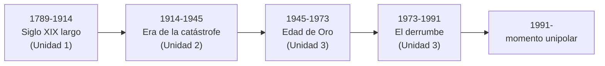

---

## Unidad 1: la herencia del siglo XIX largo

### 1. El legado de las revoluciones burguesas y la Revolución Industrial

**Puntos clave**

- Hobsbawm: **"doble revolución"** (1789-1848) = Revolución Industrial
  (económica, Inglaterra) + Revolución Francesa (política). De ahí el
  "siglo XIX largo" (1789-1914).
- Condiciones de la industrialización inglesa: **cercamientos**
  (enclosures) que expulsan campesinos → mano de obra para las fábricas;
  algodón + carbón + hierro; **imperio colonial** como fuente de materias
  primas y mercado cautivo (caso testigo: desindustrialización de la
  India; Guerras del Opio con China).
- La fábrica crea dos clases nuevas: **burguesía industrial** y
  **proletariado**.
- Segunda fase (fin de siglo XIX): acero, bienes de capital, ferrocarril
  → capitalismo financiero.
- Difusión desigual: Bélgica (fuga tecnológica de Cockerill), Francia
  (lenta, energía hidráulica), Alemania (Renania industrial vs. este
  agrario/Junkers), EE. UU. (Norte industrial vence al Sur esclavista en
  la Guerra Civil), Japón (Restauración Meiji).
- Revolución Francesa: crisis del Antiguo Régimen (sociedad estamental,
  bancarrota) → Estados Generales (1789) → tres etapas: monarquía
  constitucional (1789-92), República jacobina/Terror (1792-94), Termidor
  – Directorio – Consulado – Imperio napoleónico (1794-1815). Legado
  napoleónico: Código Civil, Banco de Francia, departamentos.

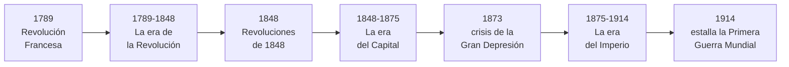

**Glosario**

Doble revolución
: Conjunción, entre 1789 y 1848, de la Revolución Industrial (económica) y
  la Revolución Francesa (política) como proceso fundacional del mundo
  contemporáneo.

Cercamientos (*enclosures*)
: Privatización de tierras comunales que expulsó a los campesinos del
  campo y generó la mano de obra disponible para la industria.

Proletariado
: Clase social surgida en las fábricas, sin medios de producción propios,
  que vende su fuerza de trabajo a cambio de un salario.

Estados Generales
: Asamblea de los tres estamentos de Francia, convocada en 1789 tras
  siglo y medio sin reunirse.

Jacobinismo
: Corriente radical de la Revolución Francesa (Robespierre) que instauró
  la República y el Terror (1793-1794).

Termidor
: Golpe de julio de 1794 que derrocó a Robespierre e inició el reflujo
  conservador de la Revolución.

### 2. El nuevo ritmo de la economía

**Puntos clave**

- **Crisis de 1873**: fin de la "era del capital" (1848-1873). No es
  sobreproducción sino **caída sostenida de la rentabilidad** (tesis de
  Hobsbawm). Lectura complementaria: Schumpeter y la **"destrucción
  creativa"**.
- Segunda Revolución Industrial: acero, química, electricidad, bienes de
  capital → capitalismo financiero.
- Dos respuestas a la caída de rentabilidad:
  - **Hacia afuera**: proteccionismo (aranceles) + imperialismo (mercados
    cautivos, materias primas baratas, colocación de capital excedente).
  - **Hacia adentro**: **taylorismo** (cronometraje, división de tareas,
    separación planificación/ejecución) y **fordismo** (cinta
    transportadora, estandarización, salarios altos → "producción en masa
    para consumo en masa").
- Gran Bretaña: única potencia que sostiene el librecambio; pasa de
  "taller del mundo" a banquero/inversor internacional.

**Glosario**

Crisis de 1873
: Gran Depresión del siglo XIX; fin de la "era del capital" por caída
  sostenida de la rentabilidad, no por sobreproducción.

Destrucción creativa
: Concepto de Schumpeter: las crisis capitalistas son fases necesarias de
  renovación tecnológica.

Proteccionismo
: Aranceles y restricciones al comercio exterior para proteger la
  producción nacional.

Taylorismo
: Organización científica del trabajo: cronometraje, división extrema de
  tareas, separación entre planificación y ejecución.

Fordismo
: Producción en cadena y en masa sostenida por salarios altos que
  convierten a los obreros en consumidores.

### 3. El reparto del mundo

**Puntos clave**

- Nuevo imperialismo (1875-1914): tres dimensiones —**económica**
  (mercados cautivos), **política** (prestigio nacional) e
  **ideológica** (eurocentrismo, "misión civilizadora").
- Formas de dominación: colonias formales, protectorados, concesiones,
  dominios, y **dominio informal** (clave para entender a América Latina
  y la Argentina: dependencia económica sin ocupación militar).
- **Congreso de Berlín (1884-1885)**: reparto de África, esferas de
  influencia.
- Gran Bretaña, única excepción librecambista: sin campesinado
  proteccionista, potencia exportadora industrial/financiera e
  importadora de materias primas.
- **Paz Armada (1870-1914)**: carrera armamentista + alianzas rígidas →
  **Triple Alianza** (Alemania, Austria-Hungría, Italia, 1882) vs.
  **Triple Entente** (Francia-Rusia 1894, + Gran Bretaña 1907).
- Belle Époque: prosperidad y revitalización cultural que convive con la
  tensión creciente entre potencias.

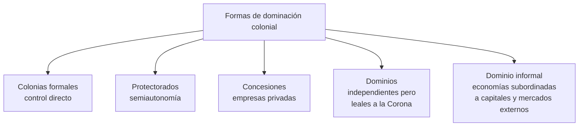

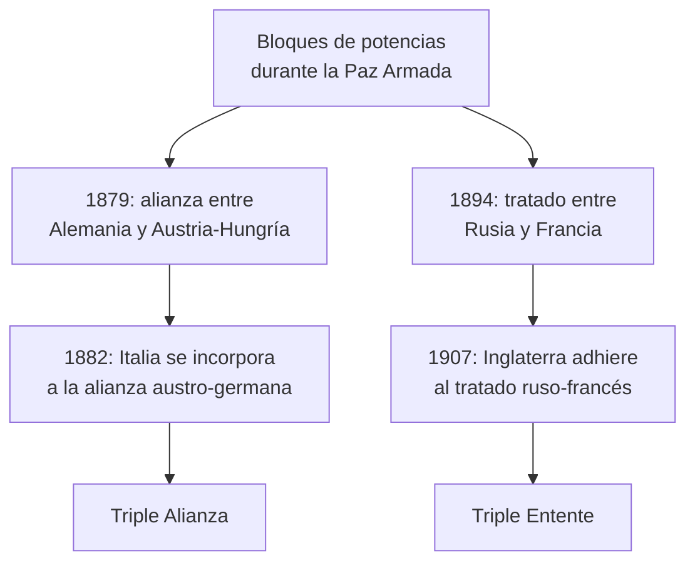

**Glosario**

Nuevo imperialismo
: Expansión colonial de las potencias industriales (1875-1914) por
  razones económicas, políticas e ideológicas combinadas.

Dominio informal
: Dominación colonial sin ocupación militar: un país formalmente
  independiente queda subordinado a capitales y mercados extranjeros.

Congreso de Berlín
: Reunión de 1884-1885 que declaró a África zona de libre comercio y
  delimitó esferas de influencia coloniales.

Belle Époque
: Período de prosperidad y revitalización económica y cultural en Europa
  occidental (≈1870-1914).

Paz Armada
: Período 1870-1914 de paz aparente, marcado por la carrera armamentista
  y las alianzas militares rivales.

Triple Alianza / Triple Entente
: Los dos bloques que dividieron a las potencias europeas antes de 1914:
  Alemania-Austria-Hungría-Italia vs. Francia-Rusia-Gran Bretaña.

### 4. La irrupción de la sociedad de masas y los cambios en los sistemas políticos

**Puntos clave**

- Del fordismo a la política: **"si puedo comprar, puedo votar"**.
  Entrada de obreros, empleados y sectores medios urbanos a la política.
- **Comuna de París (1871)**: gobierno obrero revolucionario aplastado con
  la connivencia de Prusia; muestra el temor de las élites a la
  democratización.
- Expansión gradual del **sufragio universal** (masculino) frente a la
  resistencia de las élites (sufragio **censitario** previo).
- Surgen los **partidos de masas** (socialdemócratas, laboristas) y
  sindicatos como nuevos actores capaces de movilizar a millones de
  votantes.

**Glosario**

Sociedad de masas
: Incorporación de amplios sectores antes excluidos —obreros, sectores
  medios urbanos— al consumo y a la política, desde fines del siglo XIX.

Comuna de París
: Gobierno revolucionario obrero que controló París en 1871, aplastado
  con el consentimiento tácito de Prusia.

Sufragio censitario
: Sistema en el que votar depende de poseer determinado nivel de
  recursos económicos.

Partido de masas
: Organización política capaz de movilizar y encuadrar electoralmente a
  millones de votantes, surgida con la ampliación del sufragio.

### 5. Las principales corrientes ideológicas: liberalismo, nacionalismo y socialismo

**Puntos clave**

- **Liberalismo**: raíces en el contractualismo del siglo XVII (Hobbes,
  Locke, Rousseau) + positivismo del XIX (Comte) y darwinismo social
  (Spencer). En política: constitucionalismo y sufragio; en economía:
  librecambio y propiedad privada; como ideología: individualismo y
  meritocracia.
- **Socialismo**: utópico (Owen, Fourier, sin teoría sistemática) vs.
  **científico** (Marx y Engels): materialismo histórico, lucha de
  clases, plusvalía, el Estado como instrumento de dominación de clase,
  necesidad de revolución. Secuencia marxista: fuerzas productivas →
  revolución burguesa → revolución proletaria → dictadura del
  proletariado → sociedad sin clases. Las cuatro Internacionales
  (1864 Londres, 1889 París, 1919 Moscú, 1940 París).
- **Nacionalismo**: idea moderna de nación (Fichte, Renan). El nuevo
  nacionalismo de fin de siglo es étnico-lingüístico, antisocialista,
  antiliberal, xenófobo, expansionista y antisemita; contracara:
  **internacionalismo** socialista.

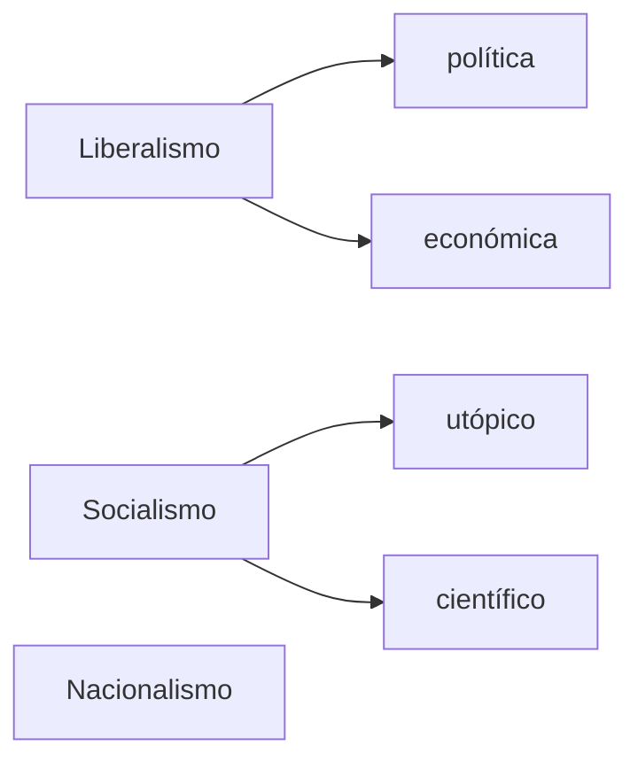

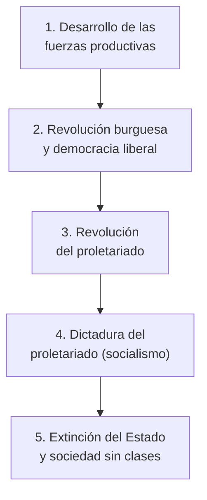

**Glosario**

Contractualismo
: Origen del poder político como pacto entre individuos que abandonan el
  estado de naturaleza (Hobbes, Locke, Rousseau).

Positivismo
: Corriente de Comte: la ciencia y la técnica resuelven los problemas
  sociales.

Darwinismo social
: Traslado de la selección natural al terreno social (Spencer).

Materialismo histórico
: La estructura económica determina la superestructura política,
  jurídica e ideológica (Marx).

Plusvalía
: Valor generado por el trabajador que el capitalista se apropia sin
  retribuir en el salario.

Internacionalismo
: Posición socialista que subordina la identidad nacional a la
  solidaridad de clase entre trabajadores de todos los países.

### 6. Panorama de América Latina y la Argentina en el tránsito de un siglo a otro

**Puntos clave**

- América Latina se inserta como proveedora de materias primas bajo
  élites oligárquicas ("Orden y Progreso"): Porfiriato en México,
  expansión de EE. UU. en el Caribe (Guerra Hispano-Estadounidense de
  1898, Corolario Roosevelt 1904).
- Argentina: dependencia con Gran Bretaña (ferrocarril radial hacia
  Buenos Aires); canasta exportadora pasa de tasajo/lana a carne
  enfriada con los frigoríficos.
- **Generación del 80** (1880-1912): régimen oligárquico con **voto
  cantado** (fraude). Leyes laicas: Ley 1420 (1884, educación laica) y
  Registro Civil.
- Inmigración masiva sin derechos políticos plenos; **Ley Ricchieri**
  (servicio militar, nacionalización) vs. **Ley de Residencia** (1902,
  expulsión de extranjeros "peligrosos").
- Conflictividad social: **Semana Roja** (1909). Represión →
  **Ley de Defensa Social** (1910).
- **Ley Sáenz Peña (1912)**: sufragio secreto y obligatorio, fin del
  fraude sistemático.
- Expansión territorial: Guerra de la Triple Alianza (1865-1870, contra
  Paraguay) y **Conquista del Desierto** (1878-1885, Roca).

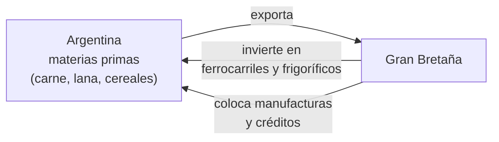

**Glosario**

Generación del 80
: Élite que dominó la Argentina 1880-1916 mediante el fraude electoral.

Voto cantado
: Voto público y manipulable, práctica fraudulenta del régimen
  conservador.

Ley de Residencia
: Ley 4144 (1902): expulsión sin juicio previo de extranjeros
  "peligrosos"; usada contra dirigentes sindicales.

Semana Roja
: Huelga general de mayo de 1909 tras la represión de una manifestación
  obrera.

Conquista del Desierto
: Campañas militares (1878-1885) que incorporaron Patagonia norte y
  región pampeana al Estado, a costa de las comunidades indígenas.

Ley Sáenz Peña
: Ley electoral de 1912: sufragio secreto y obligatorio; fin del fraude
  sistemático.

---

## Unidad 2: el mundo de entreguerras

### 1. Las guerras mundiales: rasgos y novedades

**Puntos clave**

- **"Siglo XX corto"** (Hobsbawm): 1914-1991, en tres tramos: era de la
  catástrofe (1914-1945), edad de oro (1945-1973), el derrumbe
  (1973-1991).
- **Magnicidio de Sarajevo (28/6/1914)**: Gavrilo Princip asesina a
  Francisco Fernando. **Crisis de julio**: "cheque en blanco" alemán →
  ultimátum a Serbia → reacción en cadena de alianzas.
- Fracaso del **Plan Schlieffen** → frente occidental estático → **guerra
  de trincheras** (Verdún, Somme, 1916). Nuevas armas: ametralladora,
  gases venenosos (Ypres 1915), tanque (Somme 1916), artillería pesada.
- Entrada de EE. UU. (1917: guerra submarina + telegrama Zimmermann). Rusia
  sale de la guerra (Brest-Litovsk, 1918) por la Revolución.
- **Dolchstoßlegende**: mito de la "puñalada por la espalda" tras la
  derrota alemana no invadida.
- **Tratado de Versalles (1919)**: pérdida de colonias, Alsacia-Lorena,
  corredor polaco, desmilitarización de Renania, ejército limitado,
  cláusula de culpabilidad (art. 231), reparaciones.
- Rasgos comunes de las guerras mundiales: **guerra total**, escala
  mundial, industrialización de la destrucción, disolución de la
  frontera combatientes/civiles, dimensión ideológica.

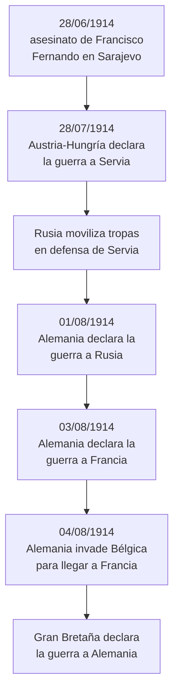

**Glosario**

Guerra total
: Conflicto que moviliza la totalidad de los recursos de un Estado y
  borra la distinción entre frente y retaguardia.

Siglo XX corto
: Periodización de Hobsbawm (1914-1991): de la Primera Guerra Mundial a
  la disolución de la URSS.

Era de la catástrofe
: Primer tramo del siglo XX corto (1914-1945): guerras mundiales, crisis
  del 29, ascenso de los fascismos.

Crisis de julio
: Sucesión de ultimátums y declaraciones de guerra (28/6 al 4/8 de 1914)
  que activó el sistema de alianzas.

Plan Schlieffen
: Plan alemán para derrotar primero a Francia por Bélgica y evitar la
  guerra en dos frentes; su fracaso generó la guerra de desgaste.

Guerra de trincheras
: Combate estático del frente occidental (1914-1917), de altísimo costo
  humano y escaso avance territorial.

Dolchstoßlegende
: Mito de la "puñalada por la espalda": la derrota alemana de 1918 se
  atribuye a una traición interna, no al fracaso militar.

Tratado de Versalles
: Tratado de paz de 1919: pérdidas territoriales y coloniales, desarme,
  reparaciones y cláusula de culpabilidad exclusiva de Alemania.

### 2. El fascismo italiano

**Puntos clave**

- Posguerra italiana: **"victoria mutilada"**, crisis económica, *biennio
  rosso* (1919-1920).
- **Empresa de Fiume (D'Annunzio, 1919)**: ensayo estético-político que
  el fascismo adopta (marcha, saludo romano, discurso de balcón).
- **Mussolini**: ex-socialista expulsado por apoyar la guerra; funda los
  *Fasci di Combattimento* (1919) → **Partido Nacional Fascista** (1921).
  **Squadrismo**: violencia paramilitar contra sindicatos y la izquierda.
- **Marcha sobre Roma (28/10/1922)**: el rey Víctor Manuel III encarga
  gobierno a Mussolini (vía formalmente legal).
- **Ley Acerbo (1923)**: dos tercios de bancas para la lista más votada.
  **Caso Matteotti (1924)**: asesinato → **Secesión del Aventino**
  fallida → **leggi fascistissime (1926)**: fin del pluralismo.
- Estado fascista: partido único, **Estado corporativo**, culto al Duce,
  **Pactos de Letrán (1929)** con la Iglesia. Las cuatro "batallas" (lira,
  trigo, natalidad, mafia).
- Política exterior: Etiopía (1935-36), Guerra Civil española, **Eje
  Roma-Berlín (1936)**.

**Glosario**

Victoria mutilada
: Percepción de posguerra de haber sido traicionados por los aliados;
  combustible simbólico del fascismo.

Squadrismo
: Violencia paramilitar de las escuadras fascistas contra la izquierda,
  previa a la toma del poder.

Ley Acerbo
: Ley electoral de 1923: dos tercios de bancas a la lista más votada,
  cualquiera fuese su margen.

Secesión del Aventino
: Retiro de la oposición del parlamento tras el asesinato de Matteotti
  (1924), sin que el rey interviniera.

Leggi fascistissime
: Leyes de 1926 que eliminan el pluralismo político y consolidan el
  poder personal de Mussolini.

Estado corporativo
: Modelo que encuadra a patronal y trabajadores en corporaciones
  controladas por el Estado.

Pactos de Letrán
: Acuerdos de 1929 entre el Estado italiano y la Santa Sede; reconocen al
  Vaticano como Estado soberano.

### 3. La Revolución Rusa y los avatares de la URSS hasta 1945

**Puntos clave**

- Rusia hacia 1900: imperio autocrático (zar **Nicolás II**), 90% de
  población campesina pobre; **Ojrana** (policía secreta); influencia
  desprestigiante de **Rasputín**.
- Fractura del POSDR (1903): **bolcheviques** (Lenin, vanguardia
  disciplinada) vs. **mencheviques** (partido abierto, gradualismo).
- **Revolución de 1905**: "Domingo Sangriento" → surgen los **soviets**.
- **Revolución de Febrero de 1917**: abdicación de Nicolás II, fin de los
  Románov. **Doble poder**: Gobierno Provisional vs. Soviet de Petrogrado.
- **Tesis de Abril** de Lenin: "Paz, Pan y Tierra", "todo el poder a los
  soviets".
- **Revolución de Octubre**: toma del Palacio de Invierno; decretos de
  paz y de tierra. **Tratado de Brest-Litovsk (1918)**: salida de la
  guerra con fuertes pérdidas territoriales.
- **Guerra civil (1918-1921)**: Ejército Rojo (Trotski) vs. Ejército
  Blanco; **Comunismo de Guerra**.
- **NEP (1921)**: retorno parcial al mercado. **URSS fundada en 1922**.
- Muerte de Lenin (1924) → pugna Trotski ("revolución permanente") vs.
  **Stalin** ("socialismo en un solo país"): gana Stalin.
- **Planes quinquenales**: industrialización acelerada + colectivización
  forzosa; eliminación de los **kulaks**; **Gulags**.
- **Gran Purga (1936-1938)**: terror estalinista; asesinato de Trotski
  (México, 1940).
- **Pacto Ribbentrop-Mólotov (1939)** → **Operación Barbarroja (1941)**
  rompe el pacto.

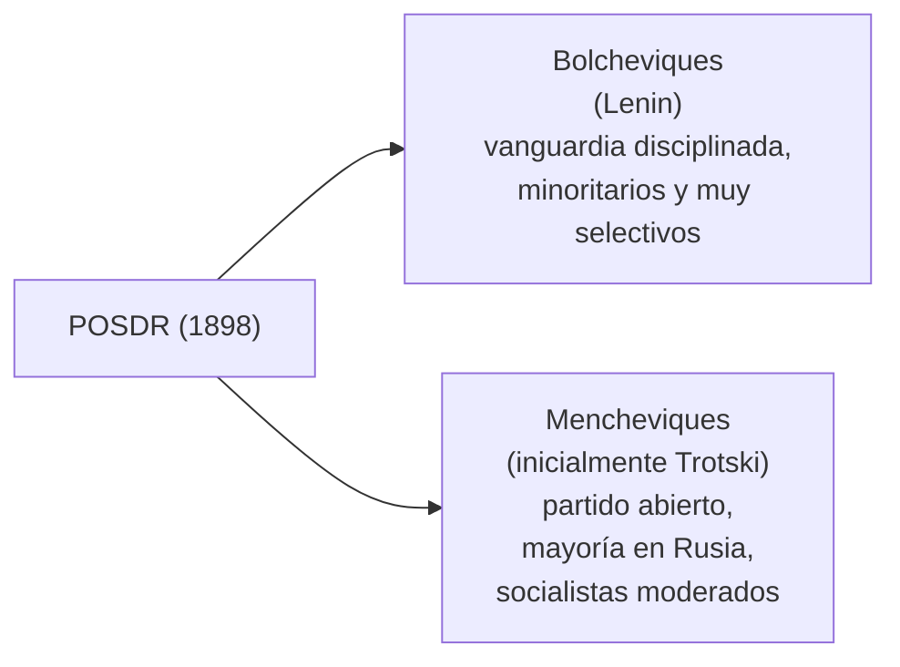

**Glosario**

Bolcheviques / mencheviques
: Facciones del POSDR (1903): vanguardia disciplinada (Lenin) vs. partido
  abierto y gradualista.

Domingo Sangriento
: Represión zarista de una marcha obrera pacífica (enero 1905); quiebra
  el vínculo pueblo-monarquía.

Tesis de Abril
: Programa de Lenin (1917): conquista inmediata del poder, "todo el
  poder a los soviets".

Comunismo de Guerra
: Requisición forzosa y racionamiento durante la guerra civil rusa
  (1918-1921).

NEP (Nueva Política Económica)
: Retorno parcial al mercado impulsado por Lenin en 1921.

Gran Purga
: Represión política de 1936-1938: Stalin elimina a la vieja guardia
  bolchevique.

### 4. La crisis económica del 29 y sus consecuencias

**Puntos clave**

- Raíz agraria previa al crac: sobreproducción agrícola mundial desde
  1922 → caída de precios → quiebras bancarias rurales → dinero migra a
  la especulación bursátil.
- **Crac de Wall Street** ("jueves negro" 24/10 y "martes negro" 29/10 de
  1929).
- Tesis de **Kindleberger**: la crisis se mundializa por la **ausencia de
  un estabilizador internacional** (Gran Bretaña ya no puede, EE. UU. no
  quiere).
- El **patrón oro** actúa como canal de contagio (políticas deflacionarias).
- **Ley Smoot-Hawley (1930)**: espiral proteccionista mundial.
- Consecuencias sociales: desempleo masivo, *Hoovervilles*.
- Respuestas: **New Deal** (Roosevelt, EE. UU.), abandono del patrón oro
  (GB 1931, EE. UU. 1933), radicalización política en Alemania,
  intervencionismo/ISI en América Latina.

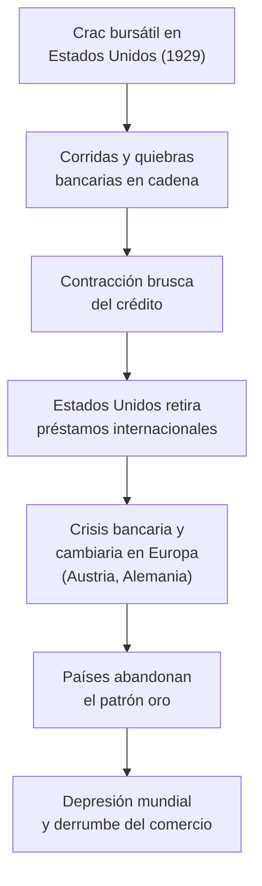

**Glosario**

Crac de 1929
: Colapso bursátil de Nueva York, octubre de 1929; inicio visible de la
  Gran Depresión.

Patrón oro
: Sistema monetario que fija el valor de cada moneda al oro; canal de
  contagio de la crisis.

Ley Smoot-Hawley
: Ley arancelaria de EE. UU. (1930) que desató la espiral proteccionista
  mundial.

New Deal
: Políticas de intervención estatal de Roosevelt desde 1933.

Estabilizador internacional (tesis de Kindleberger)
: País capaz de sostener el sistema económico internacional; su ausencia
  explica la profundidad de la crisis de 1929.

### 5. América Latina y Argentina en la era de las catástrofes (1916-1943)

**Puntos clave**

- Respuesta regional a la crisis del 29: intervencionismo estatal +
  primeros pasos de la **ISI**.
- **Yrigoyen** (1916): primer presidente electo por Ley Sáenz Peña;
  estilo **personalista**. **Reforma Universitaria (1918)**: autonomía,
  cogobierno, libertad de cátedra.
- Represión obrera bajo gobiernos radicales: **Semana Trágica (1919,
  ~500 muertos, único pogromo de América)**, **La Forestal (1921)**,
  **Patagonia rebelde (1921-22, ~1.500 fusilados)**, **Masacre de
  Napalpí (1924)**.
- **Alvear (1922-28)**: fractura antipersonalista del radicalismo.
  Yrigoyen crea **YPF (1922)**. Segunda presidencia de Yrigoyen arrasada
  por la crisis del 29.
- **Golpe de Uriburu (6/9/1930)**: primer golpe de Estado exitoso del
  siglo XX en Argentina.
- **Década infame (1930-1943)**: fraude patriótico, gobiernos de la
  **Concordancia** (Justo, Ortiz, Castillo). **Conferencia de Ottawa
  (1932)** → **Pacto Roca-Runciman (1933)** (dependencia británica).
  Primeros pasos de industrialización sustitutiva: **BCRA (1935)**, Plan
  Pinedo.
- **Golpe del 4 de junio de 1943 (GOU)**: fin de la década infame.

**Glosario**

Reforma Universitaria (1918)
: Autonomía universitaria, cogobierno de los claustros y libertad de
  cátedra, difundida por toda América Latina.

Semana Trágica
: Represión de una huelga obrera (enero 1919), ~500 víctimas, incluido el
  único pogromo registrado en América.

Liga Patriótica Argentina
: Organización parapolicial (1919) que atacó a obreros organizados y a la
  comunidad judía.

Década infame
: Período 1930-1943 sostenido por el fraude electoral sistemático de la
  Concordancia.

Pacto Roca-Runciman
: Acuerdo comercial de 1933 con Gran Bretaña: cuota de exportación de
  carnes a cambio de fuertes concesiones.

Industrialización por sustitución de importaciones (ISI)
: Estrategia, iniciada en los años 30, de producir localmente bienes
  antes importados.

GOU (Grupo de Oficiales Unidos)
: Logia militar que impulsó el golpe de junio de 1943.

### 6. Los fascismos, la Segunda Guerra y el Holocausto

**Puntos clave**

- Rasgos comunes de "los fascismos": ultranacionalismo, rechazo al
  liberalismo y al comunismo, partido único, culto al líder,
  revisionismo de Versalles. El nazismo suma un antisemitismo racial que
  termina en exterminio.
- Crisis de **Weimar**: hiperinflación (1923) + crisis del 29 → 4
  millones de desocupados.
- **Hitler**: trauma de 1918 (Dolchstoßlegende como obsesión); Partido
  Obrero Alemán → **NSDAP (1920)**; **Putsch de la Cervecería (1923)**
  fallido → decide la vía legal; en prisión escribe ***Mein Kampf***
  (antisemitismo + *Lebensraum*).
- **SA** (Röhm, choque callejero), **SS** (Himmler, élite), **SD**
  (contrainteligencia). Crecimiento electoral 1928 (2,6%) → 1932 (~37%).
- **30/1/1933**: Hitler canciller. Incendio del Reichstag (27/2/1933) →
  **Ley Habilitante (marzo 1933)**. **Noche de los cuchillos largos
  (30/6/1934)**: elimina a las SA, pacta con el Ejército.
- Persecución previa a la guerra: **Leyes de Núremberg (1935)**, **Noche
  de los Cristales Rotos (1938)**; planes de expulsión (**Plan
  Madagascar, 1940**) fracasan.
- Camino a la guerra: rearme y remilitarización de Renania (1936), Eje
  Roma-Berlín, ***Anschluss*** (1938), Sudetes y **Acuerdos de Múnich**
  (**apaciguamiento**), Pacto Ribbentrop-Mólotov (1939).
- Curso de la guerra: invasión de Polonia (1939) → **Blitzkrieg** →
  caída de Francia (1940) → Batalla de Inglaterra → **Operación
  Barbarroja** y Pearl Harbor (1941) → **Stalingrado y Kursk (1942-43,
  punto de inflexión)** → Normandía (1944) → caída de Berlín y bombas
  atómicas en Hiroshima/Nagasaki (1945).
- **Holocausto**: "Solución Final" (fines 1941), *Einsatzgruppen*,
  **Conferencia de Wannsee (1942)**, campos de exterminio. Debate
  historiográfico: **intencionalismo vs. funcionalismo**; síntesis de
  **Burrin**: "intención condicional".
- **Juicios de Núremberg**: responsabilidad penal individual.

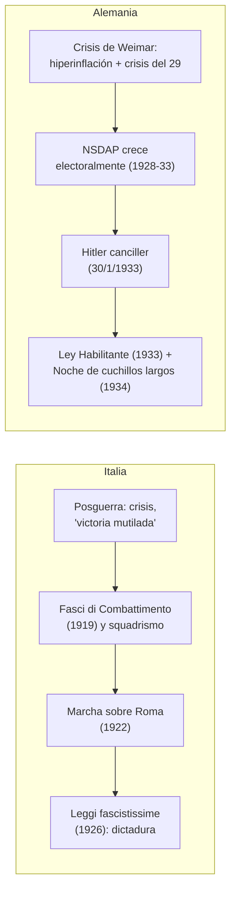

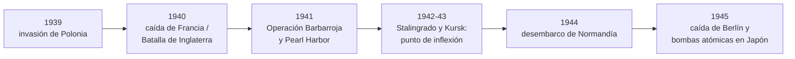

**Glosario**

Dolchstoßlegende
: Mito de la "puñalada por la espalda", núcleo de la cosmovisión de
  Hitler.

Lebensraum ("espacio vital")
: Proyecto de conquista de territorios en el Este para el asentamiento
  alemán.

SA, SS y SD
: Choque callejero (Röhm), élite/custodia del líder (Himmler) y
  contrainteligencia del partido, respectivamente.

Noche de los cuchillos largos
: Asesinato de Röhm y la cúpula de las SA (30/6/1934), precio pagado al
  Ejército.

Ley Habilitante
: Ley de marzo de 1933 que dio a Hitler poderes de gobierno casi
  absolutos.

Leyes de Núremberg
: Legislación de 1935 que definió jurídicamente quién era judío y lo
  privó de la ciudadanía.

Plan Madagascar
: Proyecto de 1940 de deportación masiva de judíos europeos, fracasado.

Apaciguamiento
: Concesiones de GB y Francia frente a Hitler (1936-1938) que no evitaron
  la guerra.

Blitzkrieg (guerra relámpago)
: Avance rápido de blindados con apoyo aéreo; respuesta a la
  imposibilidad alemana de sostener una guerra larga.

Einsatzgruppen
: Unidades móviles que fusilaron masivamente población judía desde 1941.

Conferencia de Wannsee
: Reunión de enero de 1942 que coordinó la "Solución Final".

Solución Final
: Plan nazi de exterminio industrial y sistemático de la población judía
  europea.

Intencionalismo / funcionalismo
: Debate historiográfico sobre la génesis del genocidio: programa
  premeditado vs. radicalización improvisada.

Intención condicional
: Tesis de Burrin: intención de Hitler sujeta a la condición del fracaso
  de la guerra relámpago (otoño de 1941).

---

## Unidad 3: la guerra fría

### 1. El enfrentamiento Este-Oeste: escenarios, política y cultura

**Puntos clave**

- Mundo bipolar tras 1945: Yalta y Potsdam; **"telón de acero"**
  (Churchill, 1946); Alemania dividida en RFA/RDA (1949).
- **Doctrina Truman (1947)**, **Plan Marshall (1947)**, **OTAN (1949)**
  vs. **Pacto de Varsovia (1955)**.
- Guerra Fría como "tercera guerra mundial no convencional"; equilibrio
  por **destrucción mutua asegurada (MAD)**; **complejo
  militar-industrial**.
- Escenarios "calientes": Bloqueo de Berlín (1948-49), Guerra de Corea
  (1950-53), Muro de Berlín (1961), Crisis de los misiles de Cuba
  (1962), Guerra de Vietnam (1955-75).
- Competencia cultural/simbólica: carrera espacial (Sputnik 1957, Luna
  1969).
- Paradoja de Hobsbawm: la **distensión** de los 70 (SALT, Helsinki
  1975) precipitó, no evitó, el colapso soviético; Cumbre de Washington
  (1987, Reagan-Gorbachov).

**Glosario**

Telón de acero
: Expresión de Churchill (1946) para la división de Europa en dos
  bloques.

Doctrina Truman
: Compromiso de EE. UU. (1947) de "contener" la expansión comunista.

Destrucción mutua asegurada (MAD)
: Doctrina según la cual ambas superpotencias nucleares podían
  aniquilarse mutuamente, lo que desalentaba el ataque directo.

Complejo militar-industrial
: Entramado de intereses económicos y burocráticos de la industria
  armamentista que ayudó a perpetuar la Guerra Fría.

Distensión
: Acercamiento diplomático URSS-EE. UU. en los 70, que precipitó el
  colapso soviético posterior.

### 2. El desarrollo de la URSS desde 1945 a la Perestroika

**Puntos clave**

- Bloque oriental: **Comecon (1949)** + Pacto de Varsovia (1955);
  "socialismo real" como modelo de desarrollo exportable al Tercer Mundo.
- Muerte de Stalin (1953) → **Jruschov**: "discurso secreto" (XX
  Congreso, 1956), **desestalinización**, "coexistencia pacífica".
- Límites del deshielo: **Revolución húngara (1956)** y **Primavera de
  Praga (1968)** aplastadas → **Doctrina Brézhnev**.
- **Brézhnev (1964-1982)**: estabilidad + estancamiento económico;
  distensión (SALT, Helsinki) cortada por la invasión a Afganistán
  (1979).
- Crisis de sucesión (Andrópov, Chernenko) → **Gorbachov (1985)**:
  **glásnost** (apertura) y **perestroika** (reestructuración).

**Glosario**

Comecon
: Cooperación económica del bloque soviético (1949), contraparte del
  Plan Marshall.

Desestalinización
: Denuncia y revisión de los crímenes y el culto a Stalin, iniciada por
  Jruschov en 1956.

Doctrina Brézhnev
: Derecho reservado a la URSS de intervenir militarmente en cualquier
  país del bloque que se apartara del modelo soviético.

Socialismo real
: Término de los años 60 para los sistemas efectivamente existentes en
  el bloque soviético.

Perestroika / glásnost
: Reestructuración económica y apertura política de Gorbachov desde
  1985, que aceleró la crisis final del bloque.

### 3. La caída del socialismo real

**Puntos clave**

- La perestroika desmonta controles sin construir mercado a tiempo →
  desabastecimiento; la glásnost destapa el nacionalismo interno.
- **1989**: Polonia (*Solidarność*), Hungría (frontera abierta),
  **caída del Muro de Berlín (9/11/1989)**, **Revolución de Terciopelo**
  (Checoslovaquia, Havel), Rumania (única transición violenta,
  Ceaușescu).
- Reunificación alemana (octubre 1990). Repúblicas bálticas se
  independizan (1990-91). **Golpe de agosto de 1991** fallido (Yeltsin)
  → acelera la disolución.
- **Acuerdos de Bielovezha (diciembre 1991)**: disolución de la URSS,
  creación de la **CEI**; renuncia de Gorbachov (25/12/1991).
- Causas combinadas: estancamiento económico, costo de la carrera
  armamentista, nacionalismos, pérdida de legitimidad ideológica,
  reformas de Gorbachov fuera de control.
- Consecuencia: **"momento unipolar"** de EE. UU. China sigue un camino
  distinto (reforma económica sin apertura política; Tiananmen, 1989).

**Glosario**

Glásnost
: Apertura informativa y política de Gorbachov.

Solidarność
: Sindicato independiente polaco (Wałęsa), protagonista de la primera
  transición pacífica de 1989.

Revolución de Terciopelo
: Transición pacífica en Checoslovaquia (1989), liderada por Václav
  Havel.

Acuerdos de Bielovezha
: Pacto de diciembre de 1991 que disolvió la URSS y creó la CEI.

Momento unipolar
: Predominio internacional casi sin contrapesos de EE. UU. tras 1991.

### 4. El nuevo rostro de la sociedad moderna: transformaciones, prosperidad y crisis

**Puntos clave**

- **Edad de Oro (1945-1973)**: Bretton Woods (1944, FMI/Banco Mundial),
  Estado de bienestar (keynesianismo), fordismo generalizado, *baby
  boom*.
- "Revolución social" de posguerra: declive del campesinado,
  incorporación de la mujer al trabajo, masificación educativa,
  liberalización cultural; **1968** como año de contestación global
  (Mayo Francés, derechos civiles en EE. UU., Primavera de Praga).
- Fin de la Edad de Oro: 1971 fin de Bretton Woods; **shocks petroleros
  (1973 y 1979)** → **estanflación**.
- **Giro neoliberal** (Thatcher 1979, Reagan 1981): monetarismo,
  desregulación, privatizaciones, debilitamiento sindical, globalización.
- Balance: prosperidad material + desigualdad creciente + cambios
  culturales persistentes.

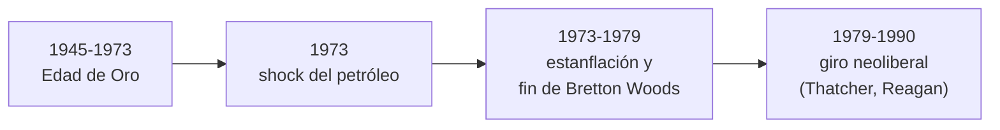

**Glosario**

Bretton Woods
: Sistema monetario de tipos de cambio fijos anclados al dólar
  (1944-1971).

Edad de Oro
: Crecimiento económico excepcional en Occidente entre 1945 y 1973.

Estanflación
: Estancamiento y desempleo combinados con inflación alta (crisis de los
  70).

Shock petrolero
: Aumento abrupto del precio del petróleo por la OPEP (1973 y 1979).

Giro neoliberal
: Desregulación, privatización y control de la inflación, desde fines de
  los 70 (Thatcher, Reagan).

### 5. América Latina y la Argentina: 1943-1955

**Puntos clave**

- **Golpe del 4/6/1943 (GOU)**: fin de la década infame. Alianza con la
  Iglesia (enseñanza religiosa obligatoria, dic. 1943).
- **Perón** en la **Secretaría de Trabajo y Previsión** (desde el
  Departamento Nacional del Trabajo): salario real +100% (1943-46),
  jubilaciones extendidas, vacaciones pagas, **SMVM**, **Estatuto del
  Peón de Campo (1944)**, aguinaldo (1945).
- **17 de octubre de 1945** ("Día de la Lealtad"): movilización obrera
  libera a Perón, detenido en Martín García.
- Elecciones de 1946: **"Braden o Perón"** vence a la Unión Democrática.
- Primer gobierno (1946-1952): **Primer Plan Quinquenal**, **IAPI**
  (transfiere ingresos del agro a la industria), nacionalización de
  ferrocarriles, **sufragio femenino (Ley 13.010, 1947)**, salud pública
  (Carrillo), Fundación Eva Perón, **Constitución de 1949** (derechos
  sociales, reelección), gratuidad universitaria (Decreto 29.337, 1949).
- Segundo gobierno (1952-1955): inflación (~62%), muerte de Eva Perón
  (26/7/1952), plan de estabilización, ruptura con la Iglesia (1954).
- **Bombardeo de Plaza de Mayo (16/6/1955)** y **golpe del 16/9/1955**
  ("Revolución Libertadora"): exilio de Perón (18 años).

**Glosario**

Secretaría de Trabajo y Previsión
: Organismo creado por Perón en 1943; base de su poder sindical.

Estatuto del Peón de Campo
: Norma de 1944: primeros derechos laborales para trabajadores rurales.

17 de octubre de 1945
: "Día de la Lealtad": movilización obrera que liberó a Perón.

IAPI
: Monopolio estatal del comercio exterior que transfirió ingresos del
  agro a la industria.

Sufragio femenino
: Ley 13.010 (1947); votado por primera vez en 1951.

Constitución de 1949
: Reforma social: derechos de ancianidad, niñez y familia, patria
  potestad compartida, reelección presidencial.

Revolución Libertadora
: Golpe militar de septiembre de 1955 que derrocó a Perón.

### 6. América Latina y la Argentina: 1955-1976

**Puntos clave**

- **Proscripción del peronismo** (1955-1973): decreto 4161/56 prohíbe
  mencionar a Perón; **fusilamientos de junio de 1956** (Valle,
  *Operación Masacre* de Walsh).
- **Frondizi (1958-62)**: pacto con Perón exiliado, **desarrollismo**
  (inversión extranjera), derrocado en 1962.
- **Guido (interinato)**: **azules vs. colorados** en el Ejército.
- **Illia (1963-66)**: legitimidad débil, derrocado por Onganía.
- **Onganía ("Revolución Argentina", 1966-70)**: Estado corporativo,
  **Noche de los Bastones Largos (1966)**, **Cordobazo (mayo 1969)**.
- Levingston → Lanusse: **GAN**, retorno de Perón (nov. 1972), fórmula
  Cámpora-Solano Lima.
- **1973**: Cámpora gana ("Cámpora al gobierno, Perón al poder"),
  renuncia a los 49 días; **masacre de Ezeiza** (junio 1973); Perón
  presidente (62% de votos, sept. 1973) con Isabel de vice; asesinato de
  **Rucci** (garante del Pacto Social).
- Muerte de Perón (1/7/1974) → **Isabel Perón**: **Triple A**,
  **Rodrigazo (1975)** → golpe del 24/3/1976.

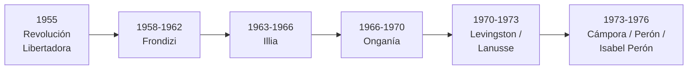

**Glosario**

Proscripción del peronismo
: Prohibición legal del Partido Peronista y de la candidatura de Perón
  (1955-1973).

Azules y colorados
: Bandos del Ejército (1962-63): legalistas vs. antiperonistas cerrados.

Cordobazo
: Levantamiento obrero-estudiantil en Córdoba (mayo 1969) que quebró la
  autoridad de Onganía.

Masacre de Ezeiza
: Enfrentamiento armado entre izquierda y derecha peronistas (junio
  1973).

Triple A
: Grupo parapolicial con amparo estatal bajo Isabel Perón.

Rodrigazo
: Devaluación y ajuste de 1975 que disparó la inflación.

### 7. América Latina y la Argentina: 1976 a principios de los 90

**Puntos clave**

- **24/3/1976**: Junta militar (Videla, Massera, Agosti) inicia el
  **"Proceso de Reorganización Nacional"**.
- **Terrorismo de Estado**: secuestros, **centros clandestinos de
  detención** (~340 según CONADEP), apropiación de bebés (~500),
  **desaparecidos** (CONADEP: 8.960; organismos de DD. HH.: 30.000).
- Economía (Martínez de Hoz): liberalización financiera ("plata dulce"),
  **tablita** cambiaria, **"bicicleta financiera"**, desindustrialización,
  deuda externa de 8.000 a 45.000 millones de dólares (1976-1983).
- Desgaste de la Junta: Videla → Viola → **Galtieri**; represión de la
  movilización de la CGT (30/3/1982).
- **Guerra de Malvinas (2/4-14/6/1982)**: hundimiento del **General
  Belgrano** (2/5); rendición humillante → caída del régimen.
- Transición: Bignone → elecciones de 1983 → **Alfonsín**: **CONADEP**
  (*Nunca Más*), **Juicio a las Juntas (1985)**, leyes de **Punto
  Final (1986)** y **Obediencia Debida (1987)** bajo presión
  "carapintada"; **Plan Austral (1985)** → **hiperinflación (1989)** →
  entrega anticipada del poder.
- **Menem (desde 1989)**: giro neoliberal, privatizaciones; hacia la
  Convertibilidad (1991).
- Síntesis 1930-1983: correspondencia entre quiebres institucionales
  (golpes) y cambios de modelo económico; 1976 invierte el sentido
  industrializador previo hacia la valorización financiera.

**Glosario**

Proceso de Reorganización Nacional
: Nombre de la dictadura militar (1976-1983).

Desaparecidos
: Víctimas del terrorismo de Estado; CONADEP documentó 8.960 casos, los
  organismos de DD. HH. sostienen 30.000.

Bicicleta financiera
: Circuito especulativo (tasas altas + tipo de cambio anunciado) que
  hizo más rentable especular que producir.

CONADEP
: Comisión creada por Alfonsín en 1983, autora del informe *Nunca Más*.

Leyes de Punto Final y de Obediencia Debida
: Leyes de 1986 y 1987 que limitaron los juicios por violaciones a los
  DD. HH.

Hiperinflación de 1989
: Crisis que forzó la entrega anticipada del poder de Alfonsín a Menem.

---

## Ejes transversales para pensar el repaso

Algunos hilos que conectan varios apuntes y unidades, útiles para
preguntas de asociación como las de los exámenes de muestra:

- **Crisis del capitalismo y sus salidas**: 1873 (proteccionismo +
  imperialismo + taylorismo/fordismo) → 1929 (New Deal, ISI, fascismos)
  → 1973 (giro neoliberal). En los tres casos, una caída de rentabilidad
  o de crecimiento dispara una reorganización política y económica de
  fondo.
- **Formas de autoritarismo del siglo XX**: fascismo italiano (vía
  legal + squadrismo), nazismo (antisemitismo racial + expansión),
  peronismo (democratización social + restricción de libertades
  políticas, según Romero), dictaduras militares argentinas
  (1930, 1943, 1955, 1966, 1976). Comparar objetivos, bases sociales y
  grado de violencia de cada una.
- **Argentina y la dependencia externa**: ferrocarril británico
  (Unidad 1) → Pacto Roca-Runciman (Unidad 2) → deuda externa desde 1976
  (Unidad 3): la relación con una potencia dominante como eje que se
  repite con distinto signo.
- **Ciclos de industrialización argentina**: agroexportación (hasta
  1930) → ISI liviana (años 30) → ISI con Perón (industria liviana y
  luego pesada) → desarrollismo (Frondizi) → segunda ISI (1966-76) →
  desindustrialización y financierización (desde 1976).
- **Violencia de Estado y sociedad civil**: Semana Trágica (1919),
  fusilamientos de 1956, Cordobazo (1969), terrorismo de Estado
  (1976-1983): la Argentina del siglo XX tiene una historia continua de
  represión estatal a la protesta social, con una escalada final hacia
  el genocidio de la última dictadura.
- **Del mundo bipolar al momento unipolar**: la caída del socialismo
  real (1989-1991) cierra el "siglo XX corto" que se había abierto en
  1914; conviene tenerlo presente como el arco narrativo que unifica las
  tres unidades del programa.

## Modelo de consignas (según los exámenes de muestra)

Los dos exámenes disponibles (`archivo-1.md` y `archivo-2.md`) piden
**asociaciones analíticas** encadenando varios temas, no preguntas
sueltas. Ejemplos del estilo a esperar:

- Revolución Industrial inglesa → industrializaciones posteriores →
  crisis de 1873 → reparto de África → Primera Guerra Mundial (alianzas,
  causas, disparador).
- Revolución Industrial → modelo agroexportador argentino → Guerra de la
  Triple Alianza y Conquista del Desierto → inmigración → Ley 1420 →
  Ley Sáenz Peña.
- Causas del fascismo italiano → toma del poder del PNF → políticas de
  gobierno.
- Causas económicas de la crisis de 1929 → consecuencias sociales.

Conviene practicar explicando estas cadenas causales completas, con
fechas y conceptos clave, en lugar de memorizar los apuntes por
separado.
